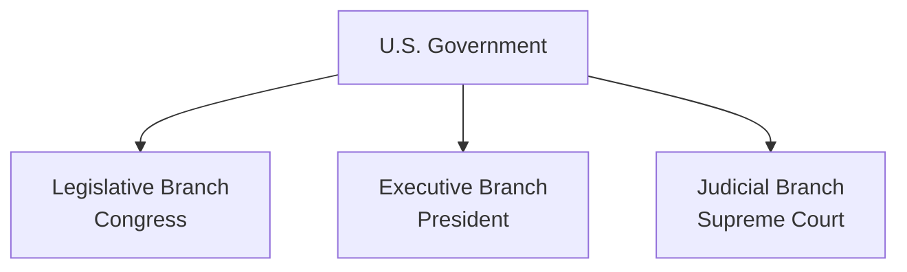
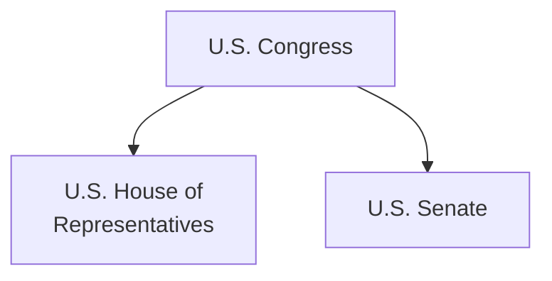
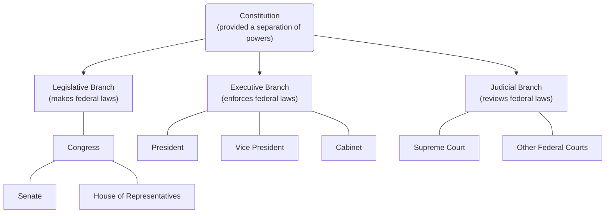
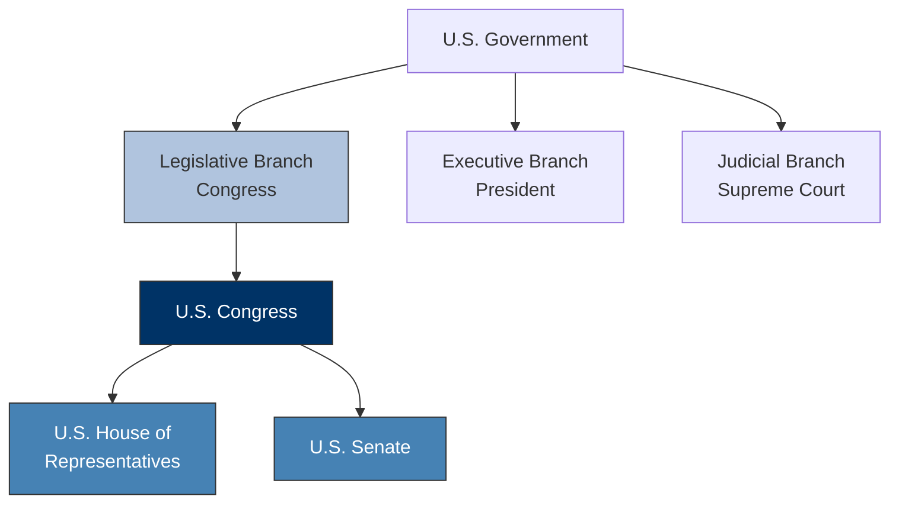
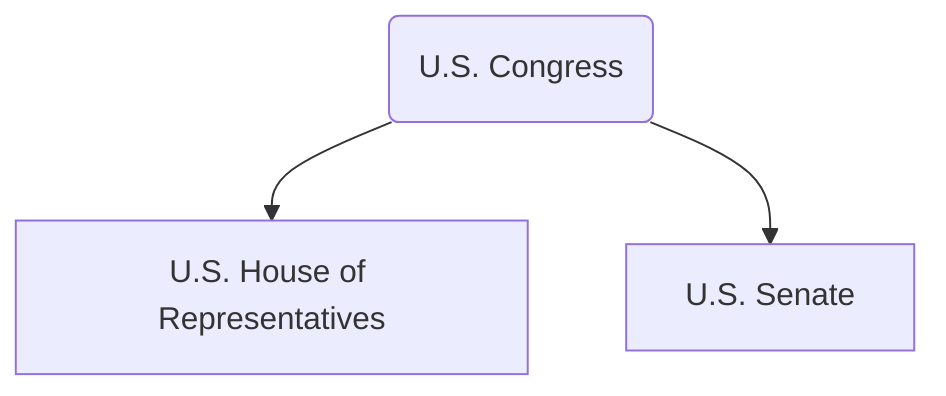
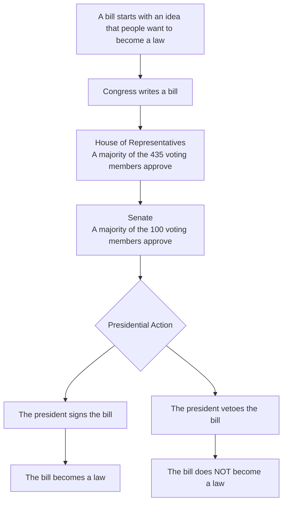
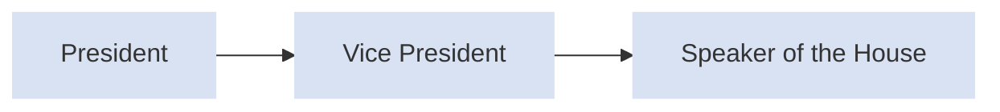

THE **USCIS** 2025 CIVICS TEST STUDY GUIDE

# One Nation, One People

U.S. Citizenship and Immigration Services

The image features a large painting depicting the signing of the U.S. Constitution, with George Washington standing prominently at a desk surrounded by other Founding Fathers in a formal hall. In the upper right corner, there is a stylized graphic of the American flag. The seal of the U.S. Department of Homeland Security is visible next to the text "U.S. Citizenship and Immigration Services".

**ARE YOU THINKING ABOUT APPLYING FOR NATURALIZATION?**
SCAN THIS QR CODE TO ACCESS INFORMATION TO HELP YOU PREPARE FOR U.S. CITIZENSHIP.

[QR Code] **USCIS CITIZENSHIP RESOURCE CENTER**
THIS QR CODE LINKS YOU TO USCIS RESOURCES AND PUBLICATIONS TO REVIEW WHILE YOU ARE PREPARING FOR YOUR NATURALIZATION TEST. YOU CAN ALSO GO TO **USCIS.GOV/CITIZENSHIP**

THE **USCIS** 2025 CIVICS TEST STUDY GUIDE

# One Nation, One People

U.S. Citizenship and Immigration Services

**One Nation, One People: The USCIS 2025 Civics Test Study Guide** (M-1175)

6 ONE NATION, ONE PEOPLE: THE USCIS CIVICS TEST TEXTBOOK

# TABLE OF CONTENTS

**Chapter 1: The U.S. Constitution ............................................................................... 8**

**Chapter 2: The Legislative Branch ............................................................................ 18**

**Chapter 3: The Executive Branch .............................................................................. 24**

**Chapter 4: The Judicial Branch................................................................................. 29**

**Chapter 5: Rights and Responsibilities ...................................................................... 33**

**Chapter 6: U.S. Geography....................................................................................... 38**

**Chapter 7: Early American History ............................................................................ 43**

**Chapter 8: The American Revolutionary War and the Declaration of Independence ........ 47**

**Chapter 9: A New Government and an Expanding Nation............................................. 52**

**Chapter 10: The Civil War......................................................................................... 58**

**Chapter 11: American History: 1900 – 2001 ................................................................ 62**

**Chapter 12: American Symbols and Holidays ............................................................. 69**

**Index: 128 Civics Test Questions and Answers ............................................................ 77**

U.S. Citizenship and Immigration Services | 7

We the People
insure domestic Tranquility, provide for the common def
and our Posterity, do ordain and establish this Constitut
Article I.
Section 1. All legislative Powers herein granted shall be vested in a Congress of the United States, which shall consist of a Senate
of Representatives.
Section 2. The House of Representatives shall be composed of Members chosen every second Year by the People of the several
in each State shall have Qualifications requisite for Electors of the most numerous Branch of the State Legislature.
No Person shall be a Representative who shall not have attained to the Age of twenty five Years, and been seven Years a Citizen
and who shall not, when elected, be an Inhabitant of that State in which he shall be chosen.
Representatives and direct Taxes shall be apportioned among the several States which may be included within this Union, according to their respective

# CHAPTER 1
# THE U.S. CONSTITUTION

**In this chapter, you will learn about:**
* [ ] **The U.S. Constitution.**
* [ ] **When the Constitution was written.**
* [ ] **What the Constitution says.**
* [ ] **Why the Constitution is the most important document in the United States government.**

> **The U.S. Constitution was written in 1787.** It is the oldest written constitution in the world. **The Constitution sets up the government** and **enshrines the basic rights of the American People.**
>
> The Constitution was written during the period when the country was created. Another word for created is "founded." The period when the country was created is called the Founding Era. In 1787, famous leaders from around the country like George Washington, Benjamin Franklin, James Madison, and Alexander Hamilton came to Philadelphia, Pennsylvania, for a Constitutional Convention. The leaders who met at the Constitutional Convention are sometimes called the Founders. **The Founders wrote the Constitution at the Constitutional Convention.**
>
> When the Founders wrote the Constitution in 1787, it had a Preamble and seven sections. There have been changes made to the Constitution since it was written. **A change to the Constitution is called an amendment. There are 27 amendments to the Constitution.** The 27 amendments are listed after the seven sections of the original Constitution.

8 | ONE NATION, ONE PEOPLE: THE USCIS CIVICS TEST TEXTBOOK

# CHAPTER 1: THE U.S. CONSTITUTION

“Scene at the Signing of the Constitution,” by Howard Chandler Christy. Courtesy of the Library of Congress.

***

**WE THE PEOPLE**

The beginning of the Constitution is called the Preamble. The Preamble to the Constitution explains why the Founders wrote the Constitution.

The Preamble also says that under the Constitution, the people of the United States will have self-government. This means that the people of the United States are not governed by a king or a queen. Instead, the people of the United States govern themselves. The people of the United States govern themselves by electing representatives who serve in the local, state, and U.S. governments.

**The idea of self-government is in the first three words of the Constitution. These words are, “We the people”.**

The Constitution of the United States.
Courtesy of the National Archives.

U.S. Citizenship and Immigration Services | 9

# THE FEDERAL GOVERNMENT

## The Three Branches of Government
The first three sections of **the Constitution set up the U.S. government.**
These sections of the Constitution describe the three branches or parts of the U.S. government. The U.S. government is also called the federal government.

**The three branches of government are called the Legislative Branch, the Executive Branch, and the Judicial Branch.**

# U.S. Government



The Legislative Branch is also called Congress. **There are two parts to the U.S. Congress. They are called the House of Representatives and the Senate.**

# Two Parts of Congress



10 | ONE NATION, ONE PEOPLE: THE USCIS CIVICS TEST TEXTBOOK

# CHAPTER 1: THE U.S. CONSTITUTION

**The President of the United States is in charge of the Executive Branch.**
Other parts of the Executive Branch include:
* The Vice President of the United States
* The President’s Cabinet
    - In government, a “cabinet” is another word for a “group of advisors.”
    **The President’s Cabinet advises the President.**
* The Executive Departments and agencies in the U.S. government

The parts of the Judicial Branch are the Supreme Court and other federal courts.
**The Supreme Court is the highest court in the U.S.**

A black and white photograph of the U.S. Capitol building in Washington, D.C., showing its large dome and neoclassical architecture under a cloudy sky.

The U.S. Capitol in Washington, D.C.

U.S. Citizenship and Immigration Services | 11

# Separation of Powers

During the Constitutional Convention, the Founders were afraid that if one person or group has too much power, then they could take over the country. They decided to separate the powers of government so that no one person or group could become too powerful. The Constitution gives each branch of government different powers. This is called "separation of powers." **Separation of powers stops one branch from becoming too powerful.**

The powers of each branch of government are:
* **The Legislative Branch (Congress) makes federal laws.**
* **The Executive Branch enforces federal laws.**
* **The Judicial Branch reviews federal laws.**

# 3 Branches of Government



12 | ONE NATION, ONE PEOPLE: THE USCIS CIVICS TEST TEXTBOOK

# CHAPTER 1: THE U.S. CONSTITUTION

## Powers of the Federal Government
The Constitution also lists the powers that the federal government has, such as the power to protect the people of the United States.

For example, **under the Constitution, the federal government has the power to create an army** to defend the nation, **and to declare war** if the U.S. has been attacked or is under threat.

**The federal government also has the power to make treaties.** A treaty is an agreement between two or more countries. Sometimes the federal government signs treaties with other countries to end wars or conflicts. Other times, the federal government signs treaties with countries to work together on issues like trade.

**Another power that the federal government has under the Constitution is to print money.** Only the U.S. government has the power to print the dollar bills and coins that people use for money in the United States.

Members of the U.S. military.

U.S. coins and currency.

Signing of mutual cooperation treaty with Japan in the East Room of the White House, January 1960. Courtesy of the Library of Congress.

U.S. Citizenship and Immigration Services | 13

# STATE GOVERNMENTS

The fourth section of the Constitution explains how state governments are set up. This section also explains how new states can join the United States.

The Constitution says that each state will have a government that has a legislative branch, an executive branch, and a judicial branch.

The person in charge of the executive branch for a state government is a called a governor. Each of the 50 states has a governor. To find out **who is the governor of your state now**, please visit: usa.gov/state-governor.

> *Washington, D.C., does not have a governor because it is not a U.S. state. Washington, D.C., residents should answer that D.C. does not have a governor.*

Under the Constitution, powers not delegated to the United States by the Constitution, nor prohibited by it to the states, are reserved for the states respectively, or to the people.

For example, **state governments have the power to provide the people of their state with protection and safety.** One way that state governments do this is by providing the people in their state with police departments and fire departments.

**State governments also have the power to provide the people of their state with schooling and education.** Each state in the U.S. has its own educational system for students in grade school, colleges and universities, and adult education programs.

Students in a U.S. classroom.

Fighting fires is among a state’s powers.

14 | ONE NATION, ONE PEOPLE: THE USCIS CIVICS TEST TEXTBOOK

# CHAPTER 1: THE U.S. CONSTITUTION

## CHANGING THE CONSTITUTION
The fifth section of the Constitution explains how the Constitution can be changed. **A change to the Constitution is called an amendment.** The Founders wanted the people of the United States to be able to make changes to the Constitution. They believed that in order to have self-government, the people of the United States should be able to make changes to the Constitution and the government.

For an amendment to be added to the Constitution it must be approved by three-fourths of the states in the United States. Today there are 50 states in the U.S. That means that 38 out of the 50 states must approve an amendment for it to be added to the Constitution. **There are 27 amendments to the Constitution.**

## SUPREME LAW OF THE LAND
The sixth section of **the Constitution says the Constitution is the supreme law of the land in the United States.** This means that everyone living in the United States must follow the Constitution. In the United States, we support the **"rule of law."** This means that we believe that **no one is above the law**, and **everyone must follow the law.** This also means that the U.S. government, state governments, and local governments must follow the Constitution and the **rule of law.**

Statue of Lady Justice

U.S. Citizenship and Immigration Services | 15

# APPROVING THE CONSTITUTION

The seventh section of the Constitution says that the people of the United States had to approve the Constitution for it to become the law of the land. When the Founders wrote the Constitution, there were 13 states in the U.S. The Constitution says that nine of the 13 original states must approve the Constitution. In 1788, New Hampshire became the ninth state to approve the Constitution, and all 13 original states approved the Constitution by 1790.

**This map identifies the 13 original states and when they approved the Constitution.**

<table>
  <tbody>
    <tr>
        <td>State</td>
        <td>Approval Date</td>
    </tr>
    <tr>
        <td>Delaware</td>
        <td>December 7, 1787</td>
    </tr>
    <tr>
        <td>Pennsylvania</td>
        <td>December 12, 1787</td>
    </tr>
    <tr>
        <td>New Jersey</td>
        <td>December 18, 1787</td>
    </tr>
    <tr>
        <td>Georgia</td>
        <td>January 2, 1788</td>
    </tr>
    <tr>
        <td>Connecticut</td>
        <td>January 9, 1788</td>
    </tr>
    <tr>
        <td>Massachusetts</td>
        <td>February 6, 1788</td>
    </tr>
    <tr>
        <td>Maryland</td>
        <td>April 28, 1788</td>
    </tr>
    <tr>
        <td>South Carolina</td>
        <td>May 23, 1788</td>
    </tr>
    <tr>
        <td>New Hampshire</td>
        <td>June 21, 1788</td>
    </tr>
    <tr>
        <td>Virginia</td>
        <td>June 25, 1788</td>
    </tr>
    <tr>
        <td>New York</td>
        <td>July 26, 1788</td>
    </tr>
    <tr>
        <td>North Carolina</td>
        <td>November 21, 1789</td>
    </tr>
    <tr>
        <td>Rhode Island</td>
        <td>May 29, 1790</td>
    </tr>
  </tbody>
</table>

Atlantic Ocean

---

# AMENDMENTS TO THE CONSTITUTION

When the Constitution was written in 1787, it did not list any of the rights of individuals. Many of the Founders believed that the Constitution should include a list of the rights of people living in the United States.

The Founders decided to add 10 amendments to the Constitution. **The first 10 amendments to the Constitution are called the Bill of Rights.** The Bill of Rights lists some of the basic rights of people living in the United States.

**There are 27 amendments to the Constitution.** Some of the amendments that were added to the Constitution after the Bill of Rights describe who can be a U.S. citizen, and who can vote in elections in the United States.

[The image shows a historical document titled "Bill of Rights" with handwritten text.]
The Bill of Rights to the U.S. Constitution.

16 | ONE NATION, ONE PEOPLE: THE USCIS CIVICS TEST TEXTBOOK

U.S. Citizenship and Immigration Services 17

[The top of the page features a photograph of the United States Capitol building dome against a sunset sky.]

# CHAPTER 2
# THE LEGISLATIVE BRANCH (CONGRESS)

**In this chapter, you will learn about:**
* [ ] **The Legislative Branch of the U.S. government.**
* [ ] **The House of Representatives.**
* [ ] **The Senate.**
* [ ] **The process for making federal laws.**

> **The Legislative Branch is one branch or part of the government.**
> Another name for the Legislative Branch is the U.S. Congress.
>
> **The Constitution says that Congress makes federal laws.** When the Founders were writing the Constitution, they believed that the power to make laws is the most important power in government. This is why the first section of the Constitution describes Congress and the power to make federal laws.
>
> During the Constitutional Convention, the Founders agreed that the people who make laws should represent the states or parts of states where they lived.
>
> When the Constitutional Convention started, the Founders did not agree on how many representatives each state should have in Congress. Some people thought that the number of representatives from each state should be based on the number of people living in the state. Others thought that each state should have the same number of representatives, no matter how many people lived in the state. They came to an agreement to have two parts to the U.S. Congress. **The two parts to the U.S. Congress are the House of Representatives and the Senate.**
>
> **States that have more people have more representatives in the House of Representatives,** and every state in the United States has two U.S. Senators.

18 | ONE NATION, ONE PEOPLE: THE **USCIS** CIVICS TEST TEXTBOOK

CHAPTER 2: THE LEGISLATIVE BRANCH (CONGRESS)

# U.S. Government



---

## House of Representatives

The image shows a map of the United States highlighting two states:
*   **Wyoming**: 1 voting member
*   **California**: 52 voting members

### Example:
**California:**
*   is the state with the most people.
*   has 52 voting members in the House of Representatives.

**Wyoming:**
*   is the state with the least people.
*   has one voting member in the House of Representatives.

### THE HOUSE OF REPRESENTATIVES
#### *Voting Members of the House of Representatives*
**There are 435 voting members in the House of Representatives.**

Each state is divided into congressional districts. The 435 voting members of the House of Representatives come from congressional districts from each of the 50 states. Each congressional district elects a person to serve as a representative in the House of Representatives.

Some states have more representatives in the House of Representatives than others.

This is because **states that have more people have more representatives in the House of Representatives.**

U.S. Citizenship and Immigration Services | 19

*Electing Members of the House of Representatives*
**Members of the House of Representatives are elected every two years.**

To get elected to the House of Representatives, a person must be at least 25 years of age and live in the state where the congressional district is located.

**One right that is only for U.S. citizens is to run for federal office.** This means that a person must be a U.S. citizen to get elected to the House of Representatives.

To find **the name of your Representative** for your congressional district please visit: house.gov.

*The Speaker of the House*
The leader of the House of Representatives is called the Speaker of the House.

To find **the name of the current Speaker of the House**, please visit: speaker.gov.

The United States Capitol in Washington, D.C., is the meeting place of the nation’s legislature, the U.S. Congress.

---

# THE SENATE

*U.S. Senators*
**There are 100 U.S. Senators in the Senate. Senators represent all the people of a state.**

Each state has two U.S. Senators.

**Example:**
* The states of California and Wyoming both have two U.S. Senators.

Map of the United States highlighting California and Wyoming.
* Wyoming is highlighted in red in the north-central region.
* California is highlighted in red on the west coast.

*Electing U.S. Senators*
**U.S. Senators are elected for six years.**

To get elected to the Senate, a person must be at least 30 years of age and they must live in the state that they represent.

**One right that is only for U.S. citizens is to run for federal office.** This means that a person must be a U.S. citizen to get elected to the Senate.

To find **the name of your U.S. Senators**, please visit: senate.gov.

> **Washington, D.C., does not have any senators because it is not a U.S. state. Washington, D.C., residents should answer that D.C. does not have a senator.**

20 | ONE NATION, ONE PEOPLE: THE USCIS CIVICS TEST TEXTBOOK

CHAPTER 2: THE LEGISLATIVE BRANCH (CONGRESS)

# U.S. Congress

## Two Parts



<table>
  <thead>
    <tr>
        <th></th>
        <th>U.S. House of Representatives</th>
        <th>U.S. Senate</th>
    </tr>
  </thead>
  <tbody>
    <tr>
        <td>435 U.S. Representatives in the House of Representatives</td>
        <td>100 U.S. Senators in the U.S. Senate</td>
        <td></td>
    </tr>
    <tr>
        <td>The number of representatives for a state depends on the number of people that live there</td>
        <td>Each state has two senators</td>
        <td></td>
    </tr>
    <tr>
        <td>Represent a district</td>
        <td>Represent all of the people of a state</td>
        <td></td>
    </tr>
    <tr>
        <td>2-year terms for U.S. Representatives</td>
        <td>6-year terms for U.S. Senators</td>
        <td></td>
    </tr>
  </tbody>
</table>

U.S. Citizenship and Immigration Services | 21

# MAKING FEDERAL LAWS

**The Constitution says that Congress makes federal laws.** A "law" is another word for a "rule" that people must follow. A "federal law" is another word for a "rule" that everyone in the United States must follow.

When members of Congress want to make a new law, they write a "bill." A bill is a proposal for a new law. For Congress to pass a bill, a majority of both the House of Representatives and the Senate must vote for it. This means that more than half of the voting members in the House of Representatives and U.S. Senators must vote in support of the bill.

**For example, there are 435 voting members in the House of Representatives.** For a bill to pass the House of Representatives, 218 members (or the majority of those voting and present) must vote in favor of the bill.

**There are 100 U.S. Senators in the Senate.** For most bills to pass the Senate, 51 U.S. Senators (or the majority of those voting and present) must vote in favor of it.

If both parts of Congress pass the bill, then the bill is sent to the President of the United States.

If the President agrees with the bill, then **the President signs the bill into law.** This means that everyone in the country must follow the law that the President signed.

If the President does not agree with the bill, then **the President vetoes the bill.** The word "veto" means that the President did not sign the bill. Then the bill does not become a law unless Congress votes to override the veto.

## How Congress Makes a Federal Law



The Oval Office of the White House. Photo by Cecil Stoughton.
Courtesy of the John F. Kennedy Presidential Library and Museum.

22 ONE NATION, ONE PEOPLE: THE USCIS CIVICS TEST TEXTBOOK

U.S. Citizenship and Immigration Services | 23

CHAPTER 3
# THE EXECUTIVE BRANCH

**In this chapter, you will learn about:**
* [ ] **The Executive Branch.**
* [ ] **The President of the United States.**
* [ ] **The agencies in the federal government.**

> **The Executive Branch is one branch or part of the U.S. government. The President of the United States is in charge of the Executive Branch.**
>
> The other parts of the Executive Branch are the President’s Cabinet, the Vice President of the United States, and the Executive Departments and agencies in the federal government.
>
> During the Constitutional Convention, the Founders were afraid that if the President had too much power, then the President would be above the law and could become a king or queen. The Founders believed that in the United States **no one is above the law. This is called the “rule of law”.** The Founders believed that the President should have the power to protect and serve the people of the United States. They also believed that the President should follow the rule of law.
>
> ### THE PRESIDENT’S CABINET
> The Executive Branch includes the Executive Departments and agencies that are part of the federal government. The Executive Departments and agencies help the President to enforce laws, protect the country, work with other countries, and provide services to the people of the United States.
>
> The people who lead the Executive Departments are mostly called Secretaries. For example, the person who leads the Department of Homeland Security is called the Secretary of Homeland Security.

24 | ONE NATION, ONE PEOPLE: THE USCIS CIVICS TEST TEXTBOOK

# CHAPTER 3: THE EXECUTIVE BRANCH

## U.S. Government

<figure>
<figcaption>U.S. Government</figcaption>
</figure>

*   **Legislative Branch**
    *   (Congress)
*   **Executive Branch**
    *   (President)
*   **Judicial Branch**
    *   (Supreme Court)

The leaders of the Executive Departments are also called Cabinet-level positions because the people who lead each agency are part of the President’s Cabinet. A “cabinet” is another word for a “group of advisors.” The President’s Cabinet advises the President.

The President can also choose to have other people from the federal government serve on the Cabinet.

Each Executive Department has many smaller agencies. For example, the Federal Bureau of Investigation (FBI) is part of the Department of Justice. Another example is U.S. Citizenship and Immigration Services (USCIS). USCIS is part of the Department of Homeland Security.

> The leader of the Department of Justice is not called a “Secretary.” The leader of the Department of Justice is called the Attorney General.

<figure>
<figcaption>President Donald J. Trump’s Cabinet, 2025.</figcaption>
</figure>

The Cabinet-level positions include:
*   Attorney General
*   Secretary of Agriculture
*   Secretary of Commerce
*   Secretary of Education
*   Secretary of Energy
*   Secretary of Health and Human Services
*   Secretary of Homeland Security
*   Secretary of Housing and Urban Development
*   Secretary of the Interior
*   Secretary of Labor
*   Secretary of State
*   Secretary of Transportation
*   Secretary of the Treasury
*   Secretary of Veterans Affairs
*   Secretary of War (Defense)
*   Vice-President
*   Administrator of the Environmental Protection Agency
*   Administrator of the Small Business Administration
*   Director of the Central Intelligence Agency
*   Director of the Office of Management and Budget
*   Director of National Intelligence
*   United States Trade Representative

## THE COMMANDER IN CHIEF

**The President of the United States is the Commander in Chief of the military.** This means that the President is in charge of everyone serving in U.S. military. Another term for the U.S. military is the U.S. Armed Forces.

In the United States, serving in the U.S. Armed Forces is voluntary. Today there are over 2 million people serving in the U.S. Armed Forces. For more information about the U.S. Armed Forces, please visit: U.S. Department of Defense at www.defense.gov.

### There are six branches of the U.S. Armed Forces:

*   **Department of the Army** - United States of America, 1775
*   **Department of the Navy** - United States Marine Corps
*   **Department of the Navy** - United States of America
*   **Department of the Air Force** - United States of America, MCMXLVII
*   **United States Space Force** - Department of the Air Force, MMXIX
*   **United States Coast Guard** - Semper Paratus, 1790

***

## VOTING FOR PRESIDENT

**U.S. citizens vote for President in November, and the President is elected for four years.** A person can only be elected to be President two times. This means a person can get elected for four years, and then get reelected for four more years.

When a person runs for President of the United States they are nominated by a political party. Today, **there are two major political parties in the United States. One party is called the Democratic Party, and the other party is called the Republican Party.**

To find **the name of the President of the United States now**, please visit: whitehouse.gov.

<table>
    <tr>
        <td>![Donkey icon with four stars]</td>
        <td>![Elephant icon with four stars]</td>
    </tr>
    <tr>
        <td>A donkey icon represents the Democratic Party.</td>
        <td>An Elephant icon represents the Republican Party</td>
    </tr>
</table>[A black and white photograph shows a young woman casting her ballot into a ballot box labeled "33" during the 1964 presidential election. Other women stand in line behind her.]
A young woman cast her ballot in the 1964 presidential election. Courtesy of the Library of Congress.

26 **ONE NATION, ONE PEOPLE: THE USCIS CIVICS TEST TEXTBOOK**

CHAPTER 3: THE EXECUTIVE BRANCH

President Donald Trump, 45th & 47th President of the United States.
President William McKinley, 25th President of the United States.

### THE VICE PRESIDENT

The Vice President of the United States works for the President in the Executive Branch. The Vice President is the President of the Senate, an advisor to the President, and a member of the President’s Cabinet.

Under the Constitution, the role of the Vice President is very important. The Constitution says that if the **President can no longer serve, then the Vice President becomes President.** There have been some Presidents who have not served all four years of their term. For example, there are Presidents who died while serving in office. When this has happened, the Vice President becomes the President.

To find **the name of the Vice President of the United States now**, please visit: whitehouse.gov.

**If both the President and the Vice President can no longer serve, then the Speaker of the House of Representatives becomes President.**

To find **the name of the current Speaker of the House**, please visit: speaker.gov.

### Line of Succession



U.S. Citizenship and Immigration Services | 27

28 **ONE NATION, ONE PEOPLE:** THE **USCIS** CIVICS TEST TEXTBOOK

UNITED STATES COURT HOUSE

## CHAPTER 4
# THE JUDICIAL BRANCH

**In this chapter, you will learn about:**
* [ ] **The Judicial Branch.**
* [ ] **The Supreme Court.**

> **The Judicial Branch is one branch or part of the government.**
>
> The parts of the Judicial Branch are the Supreme Court and other federal courts. **The Supreme Court is the highest court in the United States.** This means that the Supreme Court’s decision about a law or legal case is final. The other federal courts are sometimes called lower federal courts.
>
> When the Founders wrote the Constitution, they did not want the judges who serve on the Supreme Court and on other federal courts to make decisions about the law based on politics or elections. Judges who serve on the Supreme Court and other federal courts are sometimes called federal judges. The Founders wanted federal judges to make decisions based on the Constitution and the rule of law. This is why federal judges are not elected to office. The President nominates someone to become a federal judge on the Supreme Court or on a lower federal court. That person must also be approved by the U.S. Senate to become a federal judge.
>
> The process for a person to become a federal judge is an example of the separation of powers of government because all three branches of government are involved. **The separation of powers is important because it stops one branch of government from becoming too powerful.**

U.S. Citizenship and Immigration Services | 29

# U.S. Government

```mermaid
graph TD
    Gov[U.S. Government] --- Leg[Legislative Branch<br/>(Congress)]
    Gov --- Exe[Executive Branch<br/>(President)]
    Gov --- Jud[Judicial Branch<br/>(Supreme Court)]
    
    style Jud fill:#d1e1f0,stroke:#333,stroke-width:0px
```

# Federal Court System

<table>
  <thead>
    <tr>
        <th>Court Level</th>
        <th>Details</th>
    </tr>
  </thead>
  <tbody>
    <tr>
        <td>U.S. Supreme Court</td>
        <td>1 Court</td>
    </tr>
    <tr>
        <td>U.S. Court of Appeals</td>
        <td>13 Circuits</td>
    </tr>
    <tr>
        <td>U.S. District Courts</td>
        <td>94 Districts</td>
    </tr>
  </tbody>
</table>

Supreme Court Justices Clarence Thomas and Antonin Scalia.

30 **ONE NATION, ONE PEOPLE: THE USCIS** CIVICS TEST TEXTBOOK

CHAPTER 4: THE JUDICIAL BRANCH

### THE JUDICIAL BRANCH

One of the important **roles of the Judicial Branch is to review laws.** This means that they can decide if a law follows the Constitution. In the United States, **the Constitution is the Supreme Law of the Land.** This means that everyone in the United States must follow the Constitution. This also means that the laws that Congress writes must also follow the Constitution. If someone in the United States thinks that a law does not follow the Constitution, that person can bring a legal case to a federal court to challenge the law.

Each of the courts in the Judicial Branch can only review a law if there is a legal case before it. This means that the Supreme Court and the lower federal courts can only make a decision about a law or a legal case when they have the legal authority to hear a case that is brought before the court.

The Supreme Court may review a decision about a law or legal case from a lower federal court. If the Supreme Court reviews a decision about a law or legal case, then they must make a decision. There are no other courts in the United States that can change the decision of the Supreme Court. This is one reason that **the Supreme Court is the highest court in the United States.**

Statue of Lady Justice
***
Courtroom of the Supreme Court of the United States.

---

There are nine justices on the U.S. Supreme Court.

> **A majority means that more than half of the justices vote the same way on a case. For example: When 9 Supreme Court Justices hear a case, at least 5 justices must vote the same on the case in order to have a majority.**

### SUPREME COURT JUSTICES

**There are nine justices on the Supreme Court.** The word "justice" is another word for "judge." After the Supreme Court reviews a case, the justices meet to discuss the case and vote on the decision.

One justice on the Supreme Court is called the Chief Justice of the United States. The Chief Justice has many duties. Some of the duties are:

*   Leading the other Supreme Court justices in choosing which cases to hear.
*   Managing the courtroom when the Supreme Court is hearing a case.
*   Leading discussions with other Supreme Court justices about deciding a case.

The Chief Justice serves as a leader on the Supreme Court, but the justices make their own decisions when voting on each case. When a majority of the justices vote the same way on a case, they write a decision that explains their reasons.

**To find the name of the current Chief Justice of the United States, please visit:** supremecourt.gov/about/justices.aspx.

U.S. Citizenship and Immigration Services | 31

32 **ONE NATION, ONE PEOPLE:** THE **USCIS** CIVICS TEST TEXTBOOK

CHAPTER 1: THE U.S. CONSTITUTION

A hand is shown holding a round sticker that says "I VOTED TODAY" with stars around the border, against a blurred background of a U.S. flag.

# CHAPTER 5
# RIGHTS AND RESPONSIBILITIES

**In this chapter, you will learn about:**
- [ ] **The Bill of Rights.**
- [ ] **The rights and responsibilities of everyone living in the United States.**
- [ ] **The rights and responsibilities of U.S. citizens.**

Under our Constitution, individuals living in the United States have rights or freedoms. The word "freedom" is another word that means "right." Some rights belong to everyone living in the United States, and some rights only belong to U.S. citizens.

After the Constitutional Convention, the people of the United States had to approve the Constitution. Many people in the country did not like the Constitution in 1787 because it did not include a list of rights. Some of the Founders who were at the Constitutional Convention began to write essays called the Federalist Papers. **The Federalist Papers supported the passage of the U.S. Constitution. The writers of the Federalist Papers were James Madison, Alexander Hamilton, and John Jay.** The Federalist Papers included 85 essays about the

An image shows an aged, parchment-style document titled "Bill of Rights" with a quill pen and an inkwell resting on a wooden surface.

The Bill of Rights to the U.S. Constitution.

U.S. Citizenship and Immigration Services | 33

Constitution, and they were printed in newspapers between October 1787 – May 1788. All of the writers of the Federalist Papers signed the essays with the name **“Publius”**. The people who supported the Constitution agreed to add amendments to the Constitution that included a list of rights. **An amendment is a change to the Constitution.** Once the supporters of the Constitution agreed to add a list of rights, many more people in the United States decided to support the Constitution. In 1791, the first 10 amendments were added to the Constitution. They include some of the basic rights of U.S. citizens and individuals living in the United States. **The first 10 amendments to the Constitution are called the Bill of Rights.**

> THE
>
> **FEDERALIST:**
>
> A COLLECTION
>
> OF
>
> E S S A Y S,
>
> WRITTEN IN FAVOUR OF THE
>
> NEW CONSTITUTION,
>
> AS AGREED UPON BY THE FEDERAL CONVENTION,
> SEPTEMBER 17, 1787.
>
> IN TWO VOLUMES.
>
> VOL. I.
>
> NEW-YORK:
> PRINTED AND SOLD BY J. AND A. M'LEAN,
> No. 41, HANOVER-SQUARE.
> M.DCC.LXXXVIII.
>
> The Federalist Papers supported passing the U.S. Constitution.

---

### RIGHTS & FREEDOMS OF EVERYONE LIVING IN THE UNITED STATES TODAY

**There are five rights or freedoms in the First Amendment.**

★ ★ ★ ★ ★ ★ ★ ★ ★ ★ ★ ★ ★ ★ ★ ★

***5 rights listed in the First Amendment***
* *Speech*
* *Religion*
* *To assemble (gather)*
* *The press (media)*
* *To petition (write to) the government*

**These are rights of everyone living in the United States.**

★ ★ ★ ★ ★ ★ ★ ★ ★ ★ ★ ★ ★ ★ ★ ★

**One right or freedom in the First Amendment is the Freedom of Speech.** People in the U.S. have the right to say or write what they want without fear of going to jail.

People can use their Freedom of Speech to participate in American democracy. For example, **people can participate in American democracy by writing to a newspaper or publicly giving their opinion about an issue or policy.**

**Another right or freedom in the First Amendment is the Freedom of Religion. People in the U.S. have the right to practice any religion, or not practice a religion.**

The other amendments in the Bill of Rights list other types of rights. For example, the Sixth Amendment lists some of the rights for people who have been accused of breaking the law. The Sixth Amendment says that a person accused of breaking the law has the right to a trial with a jury to decide if that person is innocent or guilty.

34 | ONE NATION, ONE PEOPLE: THE USCIS CIVICS TEST TEXTBOOK

CHAPTER 5: RIGHTS AND RESPONSIBILITIES

### RESPONSIBILITIES OF INDIVIDUALS LIVING IN THE UNITED STATES

Everyone living in the United States is responsible for following the "rule of law." **This means that everyone living in the United States must obey the law.**

For example, it is the law that everyone living in the United States must pay income taxes. The law says that each year, people are required to send in a federal income tax form to the U.S. government. **The last day that people can send in their federal income tax forms is April 15.**

Another responsibility for men who are U.S. citizens or legal permanent residents is to register for the Selective Service. **All men who are U.S. citizens or legal residents and between the age of 18 and 26 must register for the Selective Service.**

Uniform patches and identification plates from branches of the U.S. military.

***

Voting booth in Atascadero, California, in 2008. Photo by Ace Armstrong. Courtesy of the Polling Place Photo Project.

### VOTING IN FEDERAL ELECTIONS

In the United States, **voting in federal elections is a right and a responsibility that is only for U.S. citizens.** Participating in federal elections is how U.S. citizens vote for U.S. Representatives, U.S. Senators, and the President.

**There are four amendments to the Constitution about who can vote in federal elections. These amendments say:**
* **citizens 18 and older (can vote).**
* **you don't have to pay (a poll tax) to vote.**
* **any citizen can vote (women and men can vote).**
* **a male citizen of any race (can vote).**

Currently, **U.S. citizens 18 and older can vote in federal elections.**

***

★ ★ ★ ★ ★ ★ ★ ★ ★ ★ ★ ★
### Voting Rights Timeline
The following bullets identify the Amendments and dates that correspond with each answer choice from Q48 in the text:
* **26th Amendment (1971)**
* **24th Amendment (1964)**
* **19th Amendment (1920)**
* **15th Amendment (1870)**

Other potential dates that address the expansion of voting rights include:
* **Voting Rights Act of 1965**
* **Civils Rights Act of 1964**
* **Indian Citizenship Act of 1924**
★ ★ ★ ★ ★ ★ ★ ★ ★ ★ ★ ★

U.S. Citizenship and Immigration Services | 35

# NATURALIZATION AND U.S. CITIZENSHIP

The United States has welcomed immigrants from all over the world who have helped shape and define our country.

**For more information on the eligibility requirements and process for becoming a naturalized U.S. citizen, please visit: uscis.gov/naturalization-eligibility.**

When applicants for naturalization take the Oath of Allegiance, they make important promises of loyalty to the United States. **The promises that applicants make when they become a United States citizen are to:**

*   **give up loyalty to other countries;**
*   **defend the Constitution and laws of the United States;**
*   **obey the laws of the United States;**
*   **serve in the U.S. military (if needed);**
*   **serve (do important work for) the nation (if needed); and**
*   **be loyal to the United States.**

During the naturalization ceremony, applicants for naturalization will raise their right hand say the Oath of Allegiance. At that time, they become U.S. citizens. Naturalization is one way that a person can become a U.S. citizen. **Other ways a person can become a U.S. citizen include:**

*   **being born in the United States, under conditions set by the 14th Amendment.**
*   **deriving citizenship, under the conditions set by Congress.**

> ### To become a naturalized U.S. citizen, a person must:
> *   **be 18 years old;**
> *   **be a lawful permanent resident;**
> *   **submit an application for naturalization with fees;**
> *   **meet the residence and presence in the U.S. requirements;**
> *   **be a person of good moral character and show attachment to the principles and ideals of the U.S. Constitution;**
> *   **be able to read, write, speak and understand English and have knowledge and an understanding of U.S. history and government (civics);**
> *   **complete the naturalization test and interview process; and**
> *   **attend a naturalization ceremony and take the Oath of Allegiance**

A large group of diverse people, including several individuals in military uniforms, stand outdoors on a lawn with their right hands raised, taking the Oath of Allegiance at a naturalization ceremony.

Applicants for naturalization take the Oath of Allegiance at a naturalization ceremony.

36 | ONE NATION, ONE PEOPLE: THE USCIS CIVICS TEST TEXTBOOK

U.S. Citizenship and Immigration Services | 37

# CHAPTER 6
# U.S. GEOGRAPHY

**In this chapter, you will learn about:**
* [ ] **U.S. states and territories.**
* [ ] **The U.S. borders.**
* [ ] **Mountains and rivers in the United States.**
* [ ] **The U.S. capital.**

### STATES AND TERRITORIES
When the U.S. first became a country in 1776 there were 13 original states. All of the 13 original states are located on the East Coast of the United States.

Today, the U.S. has 50 states. This is why **the American flag has 50 stars. There is one star for each state.**

On August 21, 1959, Hawaii became the 50th state to join the United States.

The U.S. also has five territories. A U.S. territory is an area that is part of the United States, but a territory is not a state.

***

#### The 13 original states are:
A map of the East Coast of the United States shows the following 13 states bordering the Atlantic Ocean:
* New Hampshire
* Massachusetts
* Rhode Island
* Connecticut
* New York
* New Jersey
* Pennsylvania
* Delaware
* Maryland
* Virginia
* North Carolina
* South Carolina
* Georgia

#### The five U.S. territories are:
A series of maps showing the following island territories:
* Virgin Islands
* Guam
* Puerto Rico
* Northern Mariana Islands
* American Samoa

38 ONE NATION, ONE PEOPLE: THE USCIS CIVICS TEST TEXTBOOK

# CHAPTER 6 – U.S. GEOGRAPHY

**C A N A D A**

A map of the contiguous United States showing the following states and locations:
*   WASHINGTON
*   OREGON
*   CALIFORNIA
*   IDAHO
*   NEVADA
*   UTAH
*   ARIZONA
*   MONTANA
*   WYOMING
*   COLORADO
*   NEW MEXICO
*   NORTH DAKOTA
*   SOUTH DAKOTA
*   NEBRASKA
*   KANSAS
*   OKLAHOMA
*   TEXAS
*   MINNESOTA
*   IOWA
*   MISSOURI
*   ARKANSAS
*   LOUISIANA
*   WISCONSIN
*   ILLINOIS
*   MISSISSIPPI
*   MICHIGAN
*   INDIANA
*   KENTUCKY
*   TENNESSEE
*   ALABAMA
*   OHIO
*   WEST VIRGINIA
*   GEORGIA
*   FLORIDA
*   SOUTH CAROLINA
*   NORTH CAROLINA
*   VIRGINIA
*   MARYLAND
*   DELAWARE
*   PENNSYLVANIA
*   NEW JERSEY
*   NEW YORK
*   CONNECTICUT
*   RHODE ISLAND
*   MASSACHUSETTS
*   VERMONT
*   NEW HAMPSHIRE
*   MAINE
*   DC ■ **Washington, D.C.**

**U N I T E D S T A T E S**

**M E X I C O**

---

Additional maps showing:
*   ALASKA
*   HAWAII
*   GUAM
*   PUERTO RICO
*   VIRGIN ISLANDS
*   AMERICAN SAMOA
*   NORTHERN MARIANA ISLANDS

This map shows the 50 U.S. states, Washington, D.C., and the 5 U.S. territories, with Canada and Mexico

The American flag is shown below the maps.

There are 50 stars in the American flag for the 50 U.S. states

U.S. Citizenship and Immigration Services | 39

# U.S. BORDERS

The United States is located in North America, and it is bordered by an ocean on the East Coast and the West Coast.

The U.S. is also bordered by one country to the north and another country to the south. The country that borders the U.S. to the north is called Canada. There are 13 states in the U.S. that border Canada.

**The ocean on the West Coast of the United States is called the Pacific Ocean.**

**The ocean on the East Coast of the United States is called the Atlantic Ocean.**

A map of the United States showing the 50 states, Washington, D.C., Canada to the north, Mexico to the south, the Pacific Ocean to the west, the Atlantic Ocean to the east, and the Gulf of Mexico. Specific states labeled on the map include: Alaska, Washington, Montana, North Dakota, Minnesota, Michigan, Ohio, Pennsylvania, New York, Vermont, New Hampshire, Maine, California, Arizona, New Mexico, and Texas.

This map shows the 50 U.S. states and Washington, D.C., with Canada and Mexico.

**The states that border Canada are:**
* **Maine**
* **New Hampshire**
* **Vermont**
* **New York**
* **Pennsylvania**
* **Ohio**
* **Michigan**
* **Minnesota**
* **North Dakota**
* **Montana**
* **Idaho**
* **Washington**
* **Alaska**

The country that borders the U.S. to the south is called Mexico. There are four states in the U.S. that border Mexico.

**The states that border Mexico are:**
* **California**
* **Arizona**
* **New Mexico**
* **Texas**

40 | ONE NATION, ONE PEOPLE: THE USCIS CIVICS TEST TEXTBOOK

CHAPTER 6 – U.S. GEOGRAPHY

## MOUNTAINS AND RIVERS
There are two large mountain ranges in the United States. The Appalachian Mountains are in the eastern United States, and the Rocky Mountains are in the western United States.

There are also many rivers in the United States. **The two longest rivers in the U.S. are the Mississippi River and the Missouri River.** The Mississippi River runs north to south, and it is located in the middle of the country. The Missouri River connects to the Mississippi River, and it runs across several states in the West.

[A map of the United States highlighting the Rocky Mountains in the west, the Appalachian Mountains in the east, the Missouri River, and the Mississippi River.]
This map shows the two longest rivers, the Mississippi River and the Missouri River.

---

## WASHINGTON D.C.
**The capital of the United States is called Washington, D.C.**

Washington, D.C., is named after George Washington. **George Washington was the first President of the United States. He is also known as the "Father of Our Country".**

The name of the capital has the letters "D.C." These letters mean "District of Columbia." Washington, D.C., is not part of a state. Washington, D.C., is located between the states of Maryland and Virginia, and it is controlled by the federal government.

Each state in the United States also has a state capital. Use the map below to find **the capital of your state.**

### The five U.S. territories are:

*   **Virgin Islands** (Capital: Charlotte Amalie)
*   **Puerto Rico** (Capital: San Juan)
*   **American Samoa** (Capital: Fagatogo)
*   **Guam** (Capital: Hagåtña)
*   **Northern Mariana Islands** (Capital: Saipan)

---

[A map of the 50 United States showing each state and its capital city.]

<table>
  <tbody>
    <tr>
        <td>State</td>
        <td>Capital</td>
    </tr>
    <tr>
        <td>Alabama</td>
        <td>Montgomery</td>
    </tr>
    <tr>
        <td>Alaska</td>
        <td>Juneau</td>
    </tr>
    <tr>
        <td>Arizona</td>
        <td>Phoenix</td>
    </tr>
    <tr>
        <td>Arkansas</td>
        <td>Little Rock</td>
    </tr>
    <tr>
        <td>California</td>
        <td>Sacramento</td>
    </tr>
    <tr>
        <td>Colorado</td>
        <td>Denver</td>
    </tr>
    <tr>
        <td>Connecticut</td>
        <td>Hartford</td>
    </tr>
    <tr>
        <td>Delaware</td>
        <td>Dover</td>
    </tr>
    <tr>
        <td>Florida</td>
        <td>Tallahassee</td>
    </tr>
    <tr>
        <td>Georgia</td>
        <td>Atlanta</td>
    </tr>
    <tr>
        <td>Hawaii</td>
        <td>Honolulu</td>
    </tr>
    <tr>
        <td>Idaho</td>
        <td>Boise</td>
    </tr>
    <tr>
        <td>Illinois</td>
        <td>Springfield</td>
    </tr>
    <tr>
        <td>Indiana</td>
        <td>Indianapolis</td>
    </tr>
    <tr>
        <td>Iowa</td>
        <td>Des Moines</td>
    </tr>
    <tr>
        <td>Kansas</td>
        <td>Topeka</td>
    </tr>
    <tr>
        <td>Kentucky</td>
        <td>Frankfort</td>
    </tr>
    <tr>
        <td>Louisiana</td>
        <td>Baton Rouge</td>
    </tr>
    <tr>
        <td>Maine</td>
        <td>Augusta</td>
    </tr>
    <tr>
        <td>Maryland</td>
        <td>Annapolis</td>
    </tr>
    <tr>
        <td>Massachusetts</td>
        <td>Boston</td>
    </tr>
    <tr>
        <td>Michigan</td>
        <td>Lansing</td>
    </tr>
    <tr>
        <td>Minnesota</td>
        <td>St. Paul</td>
    </tr>
    <tr>
        <td>Mississippi</td>
        <td>Jackson</td>
    </tr>
    <tr>
        <td>Missouri</td>
        <td>Jefferson City</td>
    </tr>
    <tr>
        <td>Montana</td>
        <td>Helena</td>
    </tr>
    <tr>
        <td>Nebraska</td>
        <td>Lincoln</td>
    </tr>
    <tr>
        <td>Nevada</td>
        <td>Carson City</td>
    </tr>
    <tr>
        <td>New Hampshire</td>
        <td>Concord</td>
    </tr>
    <tr>
        <td>New Jersey</td>
        <td>Trenton</td>
    </tr>
    <tr>
        <td>New Mexico</td>
        <td>Santa Fe</td>
    </tr>
    <tr>
        <td>New York</td>
        <td>Albany</td>
    </tr>
    <tr>
        <td>North Carolina</td>
        <td>Raleigh</td>
    </tr>
    <tr>
        <td>North Dakota</td>
        <td>Bismarck</td>
    </tr>
    <tr>
        <td>Ohio</td>
        <td>Columbus</td>
    </tr>
    <tr>
        <td>Oklahoma</td>
        <td>Oklahoma City</td>
    </tr>
    <tr>
        <td>Oregon</td>
        <td>Salem</td>
    </tr>
    <tr>
        <td>Pennsylvania</td>
        <td>Harrisburg</td>
    </tr>
    <tr>
        <td>Rhode Island</td>
        <td>Providence</td>
    </tr>
    <tr>
        <td>South Carolina</td>
        <td>Columbia</td>
    </tr>
    <tr>
        <td>South Dakota</td>
        <td>Pierre</td>
    </tr>
    <tr>
        <td>Tennessee</td>
        <td>Nashville</td>
    </tr>
    <tr>
        <td>Texas</td>
        <td>Austin</td>
    </tr>
    <tr>
        <td>Utah</td>
        <td>Salt Lake City</td>
    </tr>
    <tr>
        <td>Vermont</td>
        <td>Montpelier</td>
    </tr>
    <tr>
        <td>Virginia</td>
        <td>Richmond</td>
    </tr>
    <tr>
        <td>Washington</td>
        <td>Olympia</td>
    </tr>
    <tr>
        <td>West Virginia</td>
        <td>Charleston</td>
    </tr>
    <tr>
        <td>Wisconsin</td>
        <td>Madison</td>
    </tr>
    <tr>
        <td>Wyoming</td>
        <td>Cheyenne</td>
    </tr>
  </tbody>
</table>

This map shows the 50 U.S. states and Washington, D.C.

U.S. Citizenship and Immigration Services | 41

42 **ONE NATION, ONE PEOPLE:** THE **USCIS** CIVICS TEST TEXTBOOK

CHAPTER 7
# EARLY AMERICAN HISTORY

**In this chapter, you will learn about:**

*   [ ] **Early American History.**
*   [ ] **The Colonial Period (1607 – 1776).**
*   [ ] **The people living in the North America before 1776.**

> ### EUROPEAN COLONIES
> In the 1400s, some European countries developed ships that could sail across the ocean. Spain was the first country to send ships across the Atlantic Ocean.
>
> They did not know that the continents of North America and South America were between Europe and Asia. North and South America are sometimes called the Americas.
>
> The Europeans also did not know that there were millions of people living in North and South America. **The people living in the Americas before the Europeans arrived are called Native Americans.**
>
> By the 1500s, Spain had created colonies across North America and South America. Soon, other European countries like France, Portugal, and England started creating their own colonies in the Americas.
>
> ### NATIVE AMERICANS
> Native Americans lived in North and South America for around 20,000 years before the Europeans arrived.
>
> There were many different tribes of Native American people living in the Americas. Each Native American tribe had their own culture, religion, traditions, language, and form of government. Many tribes moved around and relied on hunting and gathering for food. There were also tribes that stayed in one place and relied on farming for food. Some tribes lived in large cities and had complex forms of government and written languages.

U.S. Citizenship and Immigration Services | 43

Before the Europeans arrived, there were more than 50 million Native Americans living in North and South America. More than 10 million Native Americans lived on the land in North America that became the United States. After Europeans arrived in North and South America, millions of Native Americans died from diseases brought by Europeans. Many Native Americans also died from wars and conflicts with Europeans.

By the 1600s, there were about 6 million Native Americans living in the Americas, and about 1 million Native Americans still living in North America.

Illustration of the town of Pomeiock by John White. Courtesy of the Jamestown Yorktown Foundation collection.

---

## THE COLONIAL PERIOD (1607 – 1776)

In 1607, the country of England created its first permanent settlement in North America. It was called Jamestown. This started the period in American history called the Colonial Period. It lasted from 1607 – 1775. During the Colonial Period, England created 13 colonies in North America.

Many colonists who settled in Jamestown **came to North America because they wanted economic opportunities.** Some colonists believed that it would be easier to buy land for farming in North America. Others thought they could find valuable metals like gold and silver.

The first years in Jamestown were difficult for the colonists. Many died from hunger, disease, or the cold winter weather. Colonists and Native Americans also fought over who would control the land. Both colonists and Native Americans died during the fighting.

A scene of a busy street in Jamestown around 1650. Courtesy of the National Park Service.

44 | ONE NATION, ONE PEOPLE: THE USCIS CIVICS TEST TEXTBOOK

CHAPTER 7: EARLY AMERICAN HISTORY

## SLAVERY IN THE COLONIES

After the first few years, the colonists in Jamestown began to have more success, and the number of colonists grew. They moved to new areas and started growing crops like tobacco and later cotton. The colonists made a lot of money selling these crops to England. They wanted to grow more crops, but they did not have enough people to work on the farms.

Other European countries that had colonies **took people from Africa to the Americas and sold them as slaves.** Another term for "slave" is an "enslaved person." An enslaved person is someone who is forced to work with no freedom. Millions of enslaved African people were forced on ships and taken to North and South America.

The first group of enslaved Africans were brought to Jamestown in 1619. Enslaved Africans were forced to work on farms in terrible conditions.

An image of the first enslaved people from Africa arriving in Jamestown.

A map showing the Atlantic Ocean between North America, South America, Europe, and Africa.

*   **North America:** Locations marked include Plymouth and Jamestown.
*   **Europe:** Countries marked include England, France, Spain, and Portugal.
*   **Africa**
*   **South America**

**Legend:**
*   European colonists' routes to North America: Blue dashed lines originating from England, France, Spain, and Portugal leading to Plymouth and Jamestown.
*   Routes bringing enslaved people to North and South America: Red solid lines originating from the coast of Africa leading to Jamestown and South America.

This map shows the routes that colonists from Europe made when coming to North America and the routes that brought enslaved people from Africa to North America and South America.

U.S. Citizenship and Immigration Services | 45

# THE 13 ORIGINAL COLONIES

As more colonists came to Jamestown, they started to create other settlements. Soon these settlements became known as the colony of Virginia.

In 1620, a group of English colonists called the Pilgrims created the colony of Massachusetts. Many of these **colonists came to North America because they wanted religious freedom.**

Soon more colonists from England began coming to North America and created more colonies. They created 13 colonies on the East Coast of North America.

The Colonial Period ended when the colonists living in the 13 original colonies declared their independence from Great Britain in 1776.

> **When the Colonial Period started in 1607, the colonists were part of the country of England. England is on the island of Britain. The country of Scotland is also on the island of Britain. In 1707, England and Scotland became one country called Great Britain. After 1707, the 13 original colonies were part of Great Britain.**

### The 13 original colonies were:

* New Hampshire
* Massachusetts
* Rhode Island
* Connecticut
* New York
* New Jersey
* Pennsylvania
* Delaware
* Maryland
* Virginia
* North Carolina
* South Carolina
* Georgia

“Pilgrims Going to Church,” by George Henry Boughton. Courtesy of the Library of Congress.

A map of the 13 original colonies on the East Coast of North America, bordering the Atlantic Ocean. The colonies shown from north to south are:
* Massachusetts
* New Hampshire
* New York
* Massachusetts (part of)
* Rhode Island
* Connecticut
* Pennsylvania
* New Jersey
* Delaware
* Maryland
* Virginia
* North Carolina
* South Carolina
* Georgia

46 ONE NATION, ONE PEOPLE: THE USCIS CIVICS TEST TEXTBOOK

CHAPTER 1: THE U.S. CONSTITUTION

# CHAPTER 8
# THE AMERICAN REVOLUTIONARY WAR & THE DECLARATION OF INDEPENDENCE

**In this chapter, you will learn about:**
* [ ] **The American Revolutionary War.**
* [ ] **The Declaration of Independence.**
* [ ] **The creation of the United States of America.**

> **CAUSES OF THE AMERICAN REVOLUTIONARY WAR**
>
> In 1775, the colonists went to war with Great Britain. This war was called the American Revolutionary War. During the American Revolutionary War, the colonists declared their independence from Great Britain, and they created the United States of America. The American Revolutionary War started in 1775. It ended in 1783 when Great Britain signed a treaty that said they agreed that the United States was an independent country.
>
> The reason **the colonists fought the British was because they did not have self-government.**
>
> When the colonists created the 13 colonies, each colony had its own colonial congress. A colonial congress was a legislative branch that made laws for each colony.
>
> Great Britain allowed the colonies to have a colonial congress as long as they paid taxes to Great Britain, obeyed all other British laws, and provided Great Britain with materials like cotton, tobacco, and rice.
>
> In the 1760s, Great Britain was fighting a war both in Europe and in North America. Great Britain needed help paying for the war. They passed laws that increased taxes on the 13 original colonies. The colonists did not think it was fair that Great Britain raised their

U.S. Citizenship and Immigration Services | 47

PUBLISHED BY CURRIER & IVES Entered according to act of Congress in the year 1876 by Currier & Ives, in the Office of the Librarian of Congress at Washington. 125 NASSAU ST. NEW YORK.
# WASHINGTON TAKING COMMAND OF THE AMERICAN ARMY.
### At Cambridge, Mass. July 3rd 1775.

“Washington Taking Command of the American Army,” by Currier & Ives. Courtesy of the National Archives, 532915.

taxes without allowing representatives from the colonies to vote on it. Many colonists began to protest against the taxes because they thought it was not fair to have **taxation without representation.**

Great Britain responded by passing laws to punish the colonists. Great Britain made the colonists pay more taxes and made the colonial congresses illegal. These taxes and laws made the colonists even angrier. Many colonists no longer wanted to be part of Great Britain. They wanted to create their own country and govern themselves.

In 1775, colonists in Massachusetts began fighting the British. Soon, all 13 original colonies were fighting against Great Britain. The colonists created an army, and George Washington was named the general of the colonial army during the American Revolutionary War. This is one reason that **George Washington is called the “Father of Our Country”.**

“George Washington at Princeton,” by Charles Willson Peale. Courtesy of the U.S. Senate.

48 | ONE NATION, ONE PEOPLE: THE USCIS CIVICS TEST TEXTBOOK

CHAPTER 8: THE AMERICAN REVOLUTIONARY WAR AND THE DECLARATION OF INDEPENDENCE

## THE DECLARATION OF INDEPENDENCE

**The Declaration of Independence was adopted on July 4, 1776. The Declaration of Independence announced our independence from Great Britain.** This is why we **celebrate Independence Day on July 4th.**

Another word for "Declaration" is "statement." Another word for "Independence" is "freedom." The Declaration of Independence is a "statement of freedom."

**Thomas Jefferson wrote the Declaration of Independence.** In the Declaration of Independence, Thomas Jefferson wrote that **everyone has the right to:**

* life;
* liberty; and
* the pursuit of happiness.

[Image of the original handwritten Declaration of Independence document.]
The Declaration of Independence.
Courtesy of the National Archives.

[Painting by John Trumbull showing Thomas Jefferson and his committee presenting the Declaration of Independence to the Continental Congress.]
In "Declaration of Independence," by John Trumbull, Thomas Jefferson and his committee present the formal statement of independence from Great Britain. Courtesy of the National Archives.

[Photograph of the interior of the Assembly room of Independence Hall, featuring green-clothed tables and wooden chairs.]
Assembly room of Independence Hall where the Declaration of Independence and the U.S. Constitution were both signed. Courtesy of the National Park Service.

When the colonists adopted the Declaration of Independence, they created the United States of America. The 13 original colonies became the 13 original states.

**The 13 original states are:**

* **New Hampshire**
* **Massachusetts**
* **Rhode Island**
* **Connecticut**
* **New York**
* **New Jersey**
* **Pennsylvania**
* **Delaware**
* **Maryland**
* **Virginia**
* **North Carolina**
* **South Carolina**
* **Georgia**

[Map of the original 13 colonies along the Atlantic coast of North America, labeled as follows:]
* Massachusetts (Maine territory)
* New York
* New Hampshire
* Massachusetts
* Rhode Island
* Connecticut
* Pennsylvania
* New Jersey
* Delaware
* Maryland
* Virginia
* North Carolina
* South Carolina
* Georgia
* Atlantic Ocean

U.S. Citizenship and Immigration Services | 49

# WINNING THE AMERICAN REVOLUTIONARY WAR

The United States stopped fighting with Great Britain in 1781. The British Army surrendered to the United States at the Battle of Yorktown in the state of Virginia. There was no more fighting, but the American Revolutionary War did not officially end until the U.S. and Great Britain signed a treaty in 1783. In the treaty, Great Britain agreed that the United States won the American Revolutionary War and that the United States was an independent nation.

An illustration depicting American, British and Hessian soldiers fighting furiously at the Siege of Yorktown. Courtesy of the Library of Congress.

Benjamin Franklin was a Founder who was famous for many things. **One thing Benjamin Franklin was famous for was being a diplomat.** A "diplomat" is someone who travels to other countries to represent the United States. Benjamin Franklin was the diplomat who negotiated the treaty with Great Britain in 1783.

A portrait of Benjamin Franklin.

> **Other answer choices for this question:**
>
> *   Oldest member of the Constitutional Convention
> *   First Postmaster General of the United States
> *   Writer of Poor Richard's Almanac
> *   Started first free libraries

50 | ONE NATION, ONE PEOPLE: THE USCIS CIVICS TEST TEXTBOOK

<table>
    <tr>
        <th></th>
        <th>U.S. Citizenship and Immigration Services</th>
        <th>51</th>
    </tr>
</table>

# CHAPTER 9
# A NEW GOVERNMENT AND AN EXPANDING NATION

**In this chapter, you will learn about:**
* [ ] **The Constitutional Convention.**
* [ ] **The conflicts caused by expansion.**
* [ ] **The expansion of U.S. territory from the Atlantic Ocean to the Pacific Ocean.**

> ### THE CONSTITUTIONAL CONVENTION
> **The Constitution was written in 1787.** It was written 11 years after **the Declaration of Independence was adopted in 1776.**
>
> After the United States won the American Revolutionary War, many people were not happy with the way the country was being governed. Many of the states disagreed on issues like trade, taxes, and other laws.
>
> Some of the country’s leaders like George Washington, Alexander Hamilton, and James Madison believed that the United States needed a new government.
>
> In 1787, leaders from all the 13 original states met in Philadelphia, Pennsylvania to create a new government. This meeting was called the Constitutional Convention. **The Founders wrote the Constitution at the Constitutional Convention.**
>
> After the Founders wrote the Constitution, the 13 original states had to vote for the Constitution.
>
> Not everyone in the country wanted the new Constitution. **James Madison, Alexander Hamilton, and John Jay wrote papers to support passing the U.S. Constitution. These papers are called the Federalist Papers.** They published the Federalist Papers in newspapers across the United States.

52 | ONE NATION, ONE PEOPLE: THE USCIS CIVICS TEST TEXTBOOK

# CHAPTER 9: A NEW GOVERNMENT AND AN EXPANDING NATION

When the states voted to pass the Constitution, the United States created a new government. When the new government was created, **George Washington was elected the first President of the United States.** He served as President from 1789 – 1797. **George Washington** is also known as the **“Father of Our Country”**.

[An illustration showing George Washington taking the Oath of Office on a balcony at Federal Hall in New York City, surrounded by other men in 18th-century attire.]
George Washington takes the Oath of Office at Federal Hall in New York City.

[An image of the title page of "The Federalist" papers.]
T H E
FEDERALIST:
A COLLECTION
O F
E S S A Y S,
WRITTEN IN FAVOUR OF THE
NEW CONSTITUTION,
AS AGREED UPON BY THE FEDERAL CONVENTION,
SEPTEMBER 17, 1787.
IN TWO VOLUMES.
VOL. I.
NEW-YORK:
PRINTED AND SOLD BY J. AND A. M'LEAN,
No. 41, HANOVER-SQUARE.
M.DCC.LXXXVIII.

The Federalist Papers supported passing the U.S. Constitution.

[An image of the original handwritten Constitution of the United States, showing the preamble starting with "We the People" and the various articles and signatures.]
The Constitution of the United States. Courtesy of the National Archives.

U.S. Citizenship and Immigration Services | 53

# THE U.S. BETWEEN 1787 – 1803

When the Constitution was written in 1787, the U.S. had 13 states on the East Coast of North America. The United States also claimed to own the land between the 13 original states and the Mississippi River as U.S. territory. The word “claim” means that other European countries that created colonies in the Americas agreed that this territory was owned by the United States.

At this time, there were still over 600,000 Native Americans living on the land claimed by the United States. Native American tribes had lived for thousands of years in the territory that the U.S. claimed. They did not agree that the U.S. owned the land. This led to many conflicts and wars in the 1800s because Native Americans were forced to defend their people, their culture, and their land.

---

## THE LOUISIANA TERRITORY

In 1803, the United States purchased the Louisiana Territory from France. The Louisiana Territory included a large amount of land between the Mississippi River and the Rocky Mountains. France sold the Louisiana Territory to the United States because they needed money to pay for wars they were fighting in Europe.

A map of North America in 1803 shows the following regions and labels:

*   **Louisiana Territory:** A large pink-shaded area in the center of the continent.
*   **United States (1803):** Green-shaded states and territories including:
    *   MASSACHUSETTS (including the area that is now Maine)
    *   VERMONT
    *   NEW HAMPSHIRE
    *   MASSACHUSETTS
    *   RHODE ISLAND
    *   CONNECTICUT
    *   NEW YORK
    *   PENNSYLVANIA
    *   NEW JERSEY
    *   DELAWARE
    *   MARYLAND
    *   DC
    *   VIRGINIA
    *   OHIO
    *   KENTUCKY
    *   TENNESSEE
    *   NORTH CAROLINA
    *   SOUTH CAROLINA
    *   GEORGIA
*   **Other Regions:**
    *   FLORIDA (shaded blue)
    *   Atlantic Ocean (to the east)
    *   Pacific Ocean (partially visible to the west)

This map shows the U.S. in 1803 in green and the Louisiana Territory in pink.

54 | ONE NATION, ONE PEOPLE: THE USCIS CIVICS TEST TEXTBOOK

# CHAPTER 9: A NEW GOVERNMENT AND AN EXPANDING NATION

When the U.S. purchased the Louisiana Territory from France, more people began moving west into the new territory. This led to more conflicts and wars between people from the United States and Native Americans.

For example, between the 1830s – 1850s, people from five Native American nations in the southern United States were forced to move from their homeland to land in the Louisiana Territory. The five Native American nations were the Cherokee, Muscogee, Seminole, Chickasaw, and Choctaw. This event is called the “Trail of Tears” because thousands of people died from disease and starvation on the trail during the journey.

Throughout the 1800s, people from the United States continued to move West. This led to more conflicts between Native Americans and people from the U.S., and more Native Americans were forced to move off their land.

Native Americans are also called American Indians. Today, there are over 500 American Indian tribes in the United States.

[The image shows a map of the United States in the 1850s, highlighting various territories and states including Washington Territory, Oregon, Utah Territory, New Mexico Territory, Nebraska Territory, Kansas Territory, Indian Territory, and Texas, along with the established eastern states.]

This map shows the U.S. in the 1850s.

### Some of the American Indian tribes in the United States are:

* Cherokee
* Navajo
* Sioux
* Chippewa
* Choctaw
* Pueblo
* Apache
* Iroquois
* Creek
* Blackfeet
* Seminole
* Cheyenne
* Arawak
* Shawnee
* Mohegan
* Huron
* Oneida
* Lakota
* Crow
* Teton
* Hopi
* Inuit

[The image shows a map detailing the routes of the Trail of Tears, with red arrows indicating the forced migration paths from states like Georgia, Alabama, and North Carolina westward into Oklahoma (Indian Territory).]

This map shows the journey that Native Americans were forced to take during the Trail of Tears.

U.S. Citizenship and Immigration Services | 55

# THE MEXICAN-AMERICAN WAR

In 1845, Texas became the 28th state to join the United States. Until 1836, Texas was part of Mexico. Texas fought for independence from Mexico and became its own country from 1836 – 1845.

At that time, Mexico still claimed much of the land in the southwest between the Rocky Mountains and the Pacific Ocean. Mexico also wanted Texas to be part of Mexico again.

In 1846, the U.S. went to war with Mexico over Texas and other land that Mexico controlled in the southwest. This war is called the Mexican-American War.

**The Mexican-American War was one war fought by the United States in the 1800s.**

The U.S. won the Mexican-American War in 1848. After the war, the United States and Mexico signed a treaty. In the treaty, Mexico agreed that Texas was part of the United States. Mexico also agreed to sell the land it claimed in the southwest to the U.S. The territory the U.S. gained from Mexico later became the states of California, Nevada, and Utah. It also included territory that became parts of the states of Arizona, Colorado, New Mexico, and Wyoming.

Today, **the states of California, Arizona, New Mexico, and Texas all border Mexico.**

[An illustration depicting a cavalry charge during a battle.]
Colonel Charles May’s troops charge at the Battle of Resaca de la Palma during the Mexican-American War.

> ### Other wars that the United States fought in the 1800s include:
> * **War of 1812**
> * **Civil War**
> * **Spanish-American War**

[A map of the United States showing territorial acquisitions.]
* **Oregon Territory** (Green)
* **British Cession 1818** (Dark Blue)
* **Mexican Cession 1848** (Orange)
* **Gadsden Purchase from Mexico 1853** (Dark Brown)
* **Louisiana Territory** (Pink) - includes IOWA, MISSOURI, ARKANSAS
* **Texas Annexation** (Blue)
* **Territory of the Original 13 States** (Light Green) - includes WISCONSIN, MICHIGAN, ILLINOIS, INDIANA, OHIO, PENNSYLVANIA, NEW YORK, VERMONT, NEW HAMPSHIRE, MAINE, MASSACHUSETTS, RHODE ISLAND, CONNECTICUT, NEW JERSEY, DELAWARE, MARYLAND, DC, VIRGINIA, KENTUCKY, TENNESSEE, NORTH CAROLINA, SOUTH CAROLINA, GEORGIA, ALABAMA, MISSISSIPPI.
* **Spanish Cession 1819** (Red) - FLORIDA
* **Mexico** (Light Grey, south of the border)
* **Pacific Ocean** (West)
* **Atlantic Ocean** (East)

This map shows the United States after the Mexican-American War.

56 | ONE NATION, ONE PEOPLE: THE USCIS CIVICS TEST TEXTBOOK

# CHAPTER 9: A NEW GOVERNMENT AND AN EXPANDING NATION

## EXPANDING INTO THE WEST
In 1850, California became the 31st state to join the United States, and it was the first state to join the United States that bordered the Pacific Ocean.

By 1860, there were 33 states in the United States. **The Atlantic Ocean bordered the U.S. on the East Coast, and the Pacific Ocean bordered the U.S. on the West Coast.** The U.S. also claimed all of the land between Canada and Mexico that today makes up the first 48 states to join the United States.

The growth of the country not only led to conflicts with Native Americans and Mexico, it also led to conflicts between people from the United States moving to the West. The biggest conflict was over slavery.

The conflicts over **slavery** in the South and the West were **one problem that led to the Civil War.**

> <mark>**Other answer choices for this question:**
> * **economic reasons**
> * **states' rights**</mark>

U.S. Citizenship and Immigration Services | 57

# CHAPTER 10
# THE CIVIL WAR

**In this chapter, you will learn about:**
* [ ] **Slavery during the 1800s.**
* [ ] **The Civil War.**
* [ ] **Abraham Lincoln.**
* [ ] **The end of slavery in the U.S.**

### SLAVERY IN THE 1800S
During the 1800s, the states in the southern United States began to depend more on growing cotton and other crops for sale to countries in Europe. Landowners depended on enslaved people to do the work.

As the U.S. gained more territory, many people who owned slaves in the South wanted to move to the new states and territories in the West. They wanted to find more land to grow crops like cotton, corn, and tobacco. They also wanted slavery to be legal in the West so they could bring enslaved people to work on the farms and grow crops.

Most northern states passed laws against slavery, and many people in the North did not want slavery to be legal in the West. When people from the North and the South began moving west in the 1800s, there were many conflicts about whether slavery should be legal in the new states and territories. Congress began to pass laws that said where slavery was legal in the West and where it was not.

Picking cotton on a Georgia plantation. Courtesy of the Library of Congress.

58 | ONE NATION, ONE PEOPLE: THE USCIS CIVICS TEST TEXTBOOK

# CHAPTER 10: THE CIVIL WAR

## FIGHTING FOR CIVIL RIGHTS AND FIGHTING TO END SLAVERY

Between 1800 -1860 there were people who thought that slavery should be illegal and that everyone in the U.S. should have civil rights. For example, Frederick Douglass escaped from slavery and became an important civil rights leader in the 1800s. He is famous for giving speeches and writing books about ending slavery and protecting civil rights for all people.

**Susan B. Anthony** is another person who **fought for civil rights** during the 1800s. She agreed with Frederick Douglass that slavery should be illegal. **Susan B. Anthony also fought for women’s rights.** She wanted women to be treated equally to men, and she wanted women to have the right to vote in the United States.

<table>
    <tr>
        <td>![Portrait of Frederick Douglass]</td>
        <td>![Portrait of Susan B. Anthony]</td>
    </tr>
    <tr>
        <td>FREDERICK DOUGLASS.</td>
        <td>Susan B. Anthony.&lt;br/&gt;*From a photograph by Veeder, Albany.*</td>
    </tr>
    <tr>
        <td>Frederick Douglass. Courtesy of the National Park Service.</td>
        <td>Susan B. Anthony. Courtesy of the Library of Congress.</td>
    </tr>
</table>***

## THE BEGINNING OF THE CIVIL WAR

In 1861, the U.S. started fighting the Civil War. **The Civil War is one war that the U.S. fought during the 1800s. The Civil War was fought between the North and the South** between 1861 – 1865.

**One problem that led to the Civil War was slavery.** The states in the South believed that slavery should be legal. They were afraid that states in the North wanted to make slavery illegal in the whole country. The states in the North were also afraid that the Southern states wanted to make slavery legal in the whole country.

The Civil War started in 1861 after 11 states in the South left the United States and tried to create their own country. They called their country the Confederate States of America. The states in the North were still called the United States of America.

<table>
    <tr>
        <td>![Painting of the Civil War Battle of Antietam]</td>
        <td>![Map of the United States in 1861 showing Free states, Slave States, and Territories]</td>
    </tr>
    <tr>
        <td>Civil War Battle of Antietam.</td>
        <td>The United States in 1861, at the start of the Civil War.</td>
    </tr>
</table>**Map Legend: The United States in 1861**
<table>
  <thead>
    <tr>
        <th>Color</th>
        <th>Status</th>
    </tr>
  </thead>
  <tbody>
    <tr>
        <td>Pink</td>
        <td>Free states</td>
    </tr>
    <tr>
        <td>Blue</td>
        <td>Slave States</td>
    </tr>
    <tr>
        <td>Green</td>
        <td>Territories</td>
    </tr>
  </tbody>
</table>

U.S. Citizenship and Immigration Services | 59

# ABRAHAM LINCOLN
**Abraham Lincoln led the United States during the Civil War.** He was the 16th President of the United States, and he served as President from 1861 – 1865.

During the Civil War, **Abraham Lincoln signed the Emancipation Proclamation. The Emancipation Proclamation freed the slaves in most Southern states.** “Emancipation” is another word for “freedom.” “Proclamation” is another word for “announcement.” The Emancipation Proclamation announced that people who were enslaved in most Southern states were free. Most people enslaved in Southern states were not actually freed until after the Civil War was over.

The North won the Civil War when the South surrendered in April 1865. A few days after the South surrendered to the North, Abraham Lincoln was assassinated. The word “assassinated” means that a person is murdered for political reasons.

Portrait of Abraham Lincoln.

Abraham Lincoln visits a battlefield during the Civil War.

“Emancipation,” by Thomas Nast. Courtesy of the Library of Congress. The illustration shows a family of freed African Americans in a domestic setting, with a portrait of Abraham Lincoln below.

60 | ONE NATION, ONE PEOPLE: THE USCIS CIVICS TEST TEXTBOOK

# CHAPTER 10: THE CIVIL WAR

### THE END OF SLAVERY
After the Civil War was over, all the people who were enslaved in Southern states were freed. On June 19, 1865, enslaved people living in Galveston, Texas, became the last to learn that the Civil War was over and that they were free. June 19th became a holiday called Juneteenth. Today, **Juneteenth is a national U.S. holiday that recognizes and celebrates the end of slavery in the United States.**

On December 6, 1865, the 13th Amendment was added to the Constitution. **An amendment is a change to the Constitution.** The 13th Amendment says that slavery is illegal in the United States.

U.S. Citizenship and Immigration Services | 61

CHAPTER 11: AMERICAN HISTORY: 1900-2001

# CHAPTER 11
# AMERICAN HISTORY: 1900-2001

***

**In this chapter, you will learn about:**

*   [ ] **The wars the U.S. fought in the 1900s.**
*   [ ] **The Great Depression.**
*   [ ] **The Cold War.**
*   [ ] **The Civil Rights Movement.**
*   [ ] **September 11, 2001.**

By the 1900s, more people in the United States were moving to cities to work in factories, and immigrants from all over the world were moving to the U.S. The United States’ economy was starting to grow, and soon the U.S. would begin to increase the size of its military.

An illustration shows a large complex of red brick rubber-making factories with many smoking chimneys situated along a river. Horse-drawn carriages and people are visible on the streets around the industrial buildings.

Rubber-making factories on a river in 1897. Courtesy of the Library of Congress.

62 | ONE NATION, ONE PEOPLE: THE USCIS CIVICS TEST TEXTBOOK

CHAPTER 11: AMERICAN HISTORY 1900 - 2001

### WORLD WAR I

In 1914, a war started in Europe. When the war started, it was called The Great War. Today, the Great War is called World War I. There were many countries fighting on each side of the war during World War I.

**World War I is one war fought by the United States in the 1900s.** World War I was fought by countries from around the world from 1914 – 1918, but the U.S. did not join the war until 1917. The U.S. fought in World War I from 1917 – 1918.

World War I ended on November 11, 1918. Today, we celebrate Veterans’ Day every November 11 in honor of the men and women (alive and deceased) who have served in the military. **Veterans’ Day is a national U.S. Holiday.**

[The image shows American soldiers in a trench in France during World War I. Courtesy of the Library of Congress.]

[The image shows two sailors reading a newspaper with the headline “GREAT WAR ENDS.” Courtesy of the Library of Congress.]

**Woodrow Wilson was President during World War I.** Woodrow Wilson was the 28th President of the United States, and he was President from 1913 – 1921.

> **Other wars that the United States fought in the 1900s include:**
> * World War II
> * Vietnam War
> * Korean War
> * (Persian) Gulf War

***

### THE GREAT DEPRESSION

When President Roosevelt was elected in 1933, the U.S. was in the Great Depression. The Great Depression was the worst time for the U.S. economy in American history.

**The economic system in the United States is called a “capitalist economy”.** It is also sometimes called a **“market economy”**. In a market economy, the government does not control the economy. Also, people are free to start a business and make money.

The Great Depression had terrible effects on the American economy. During the Great Depression, banks and businesses around the country closed, and many people could not a get a job. A lot of people in the U.S. lost their homes and their money.

[The image shows a statue of a Depression breadline at the Franklin Delano Roosevelt Memorial, Washington, D.C. Courtesy of the Library of Congress.]

[The image shows a migrant agricultural worker’s family during the Great Depression. Photograph by Dorothea Lange. Courtesy of the Library of Congress.]

U.S. Citizenship and Immigration Services | 63

# FRANKLIN ROOSEVELT

In 1933, Franklin Roosevelt was elected the 32nd President of the United States. Franklin Roosevelt was the longest-serving President in U.S. history, and he was elected President four times. He was President from 1933 – 1945, and he died while serving as President in 1945. In 1951, the 22nd amendment was added to the Constitution. **An amendment is a change to the Constitution.** The 22nd Amendment says a person can only be elected President two times.

Franklin Roosevelt was President during two important periods in American history. He **was President during the Great Depression and World War II.**

# WORLD WAR II

In 1939, World War II started when Germany attacked Poland. Germany then began to attack other European countries. Japan and Italy agreed to fight on the same side as Germany.

**World War II was one war that the U.S. fought in the 1900s.**
The U.S. fought in World War II from 1941 – 1945.

On December 7, 1941, Japan attacked the United States at a U.S. naval base in Hawaii called Pearl Harbor. On December 8, President Roosevelt announced that the U.S. would enter World War II. Later that day, Congress voted to declare war. **The power to declare war is one power that belongs to the federal government under the Constitution.**

**During World War II, the U.S. fought Japan, Germany, and Italy.**

The U.S. did not fight these countries alone. The United Kingdom, France, Russia, and other countries fought against Japan, Germany, and Italy. World War II ended in 1945 when Germany and Japan surrendered.

President Franklin D. Roosevelt signing the Declaration of War against Japan on December 8, 1941. Courtesy of the National Archives.

Bombing of USS West Virginia, Pearl Harbor, Hawaii. Courtesy of the Library of Congress.

64 ONE NATION, ONE PEOPLE: THE USCIS CIVICS TEST TEXTBOOK

# CHAPTER 11: AMERICAN HISTORY 1900 - 2001

## THE COLD WAR

When the United States fought in World War II, the U.S. and Russia fought on the same side. Russia controlled many nearby countries. Russia, and the countries it controlled, were called the Soviet Union. The U.S. and the Soviet Union did not trust each other. After World War II, the United States and the Soviet Union became involved in the Cold War.

**During the Cold War, the main concern of the United States was the spread of communism.** Communism is a type of government in which the government plans the economy and controls most of the resources. Also, in most communist countries, the government is controlled by one political party. Russia and all the countries in the Soviet Union were communist. Other countries like China and North Korea were also becoming communist. The U.S. wanted to stop other countries around the world from becoming communist.

The Cold War did not have soldiers from the U.S. and the Soviet Union fighting each other in battles. Instead, the U.S. and the Soviet Union had diplomats and spies who used information and threats against each other.

In 1953, Dwight Eisenhower became the 34th President of the United States. He served from 1953 – 1961. **Before he was President, Eisenhower was a general in World War II.** While he was President, the U.S. and the Soviet Union were building large armies in case they went to war. The U.S. and the Soviet Union also began trying to send rockets into space. In 1957, the Soviet Union became the first country to send a satellite into space. In 1969, the U.S. became the first country to land a person on the moon.

The Cold War ended in 1991 when the Soviet Union collapsed.

Portrait of General Dwight D. Eisenhower in military uniform.
General Dwight D. Eisenhower, 1945.
Courtesy of the National Archives.

A world map highlighting the United States in blue and the Soviet Union in green, separated by the Atlantic Ocean.
This map shows the United States and the Soviet Union during the Cold War.

Photograph of an astronaut standing on the lunar surface next to the American flag.
Astronaut Edwin E. Aldrin Jr., on the Moon.
Courtesy of NASA.

U.S. Citizenship and Immigration Services | 65

# THE CIVIL RIGHTS MOVEMENT

During the 1900s, many states had laws that discriminated against people based on their race. Some of these laws said that people of different races had to go to separate schools, eat in separate restaurants, and live in separate neighborhoods. Other laws made it difficult for people to vote based on their race. Many of the states that had these laws wanted to separate Black Americans from White Americans. Some states had laws that discriminated against Latino Americans and Asian Americans.

Soon after World War II ended, many people in the United States began a movement to end racial discrimination. **The movement to end racial discrimination in the United States is called the Civil Rights Movement.**

During the Civil Rights Movement, many people worked to end the laws that separated people based on their race or made it difficult for people to vote based on their race. For example, **Martin Luther King, Jr., fought for civil rights.** He was a leader in the Civil Rights Movement who organized peaceful protests against racial discrimination and laws that separated people by race. A lot of his work focused on fighting for civil rights for Black Americans, but he wanted all people in the United States to have civil rights.

There were also many Latino Americans, Asian Americans, and people from other communities that helped lead the fight for civil rights. For example, Cesar Chavez and Dolores Huerta were civil rights leaders from the Latino American community.

The Civil Rights Movement led to many changes in the United States. Martin Luther King, Jr., and other civil rights leaders were able to convince Congress to pass two laws that protect civil rights and voting rights. In 1964, Congress passed a law called the Civil Rights Act. This law says it is illegal to discriminate against someone based on their race, religion, sex, or national origin. In 1965, Congress passed another law called the Voting Rights Act. This law says that states cannot deny people the right to vote based on their race.

Today, **Martin Luther King, Jr. Day is a national holiday.** We celebrate Martin Luther King, Jr. Day on the third Monday in January.

[A portrait of Dr. Martin Luther King, Jr.]
Dr. Martin Luther King, Jr., civil rights leader.

[A portrait of Dolores Huerta.]
Dolores Huerta, civil rights leader.

[A black and white photograph of the March on Washington in 1963, showing a crowd of people holding signs that say "WE DEMAND EQUAL RIGHTS NOW!", "MARCH FOR INTEGRATED SCHOOLS NOW!", and "WE DEMAND AN END TO POLICE BRUTALITY NOW!"]
The March on Washington in 1963.

66 | ONE NATION, ONE PEOPLE: THE USCIS CIVICS TEST TEXTBOOK

# CHAPTER 11: AMERICAN HISTORY 1900 - 2001

## SEPTEMBER 11, 2001
**On September 11, 2001, terrorists attacked the United States.**

Terrorists hijacked four airplanes. Two airplanes crashed into the World Trade Center in New York City. One plane crashed into the Pentagon in Arlington, Virginia, near Washington, D.C. The passengers on the fourth plane fought the terrorists and the plane crashed in Shanksville, Pennsylvania.

Almost 3,000 people died in the September 11th terrorist attacks. The September 11, 2001, terrorist attacks were the worst attacks on the United States' homeland since Japan attacked Pearl Harbor in 1941.

Firefighters unfurl a large American flag over the scarred stone of the Pentagon on September 12, 2001. White House photo by Paul Morse.

Rescue workers amid debris following September 11th terrorist attack on World Trade Center, New York City.

U.S. Citizenship and Immigration Services | 67

TEST YOUR KNOWLEDGE...

68 **ONE NATION, ONE PEOPLE:** THE **USCIS** CIVICS TEST TEXTBOOK

CHAPTER 12
# AMERICAN SYMBOLS AND HOLIDAYS

**In this chapter, you will learn about:**
* [ ] **The Statue of Liberty.**
* [ ] **The national anthem.**
* [ ] **The American flag.**
* [ ] **National holidays that have special meaning in the United States.**

### AMERICAN SYMBOLS
#### The Statue of Liberty
The Statue of Liberty is a famous symbol of the United States. In 1886, France gave the statue to the United States as a symbol of friendship.

It is a symbol of freedom and democracy. **The Statue of Liberty is in New York Harbor on Liberty Island.** Every year, over 4 million people from around the world visit the Statue of Liberty.

The statue is of a woman holding a torch in her right hand and a tablet in her left hand. The tablet has the date July 4, 1776, on it. **July 4, 1776, is when the Declaration of Independence was adopted.**

The image shows the Statue of Liberty standing on its pedestal on Liberty Island, with trees and a stone wall in the foreground and a clear blue sky in the background.

Statue of Liberty. Courtesy of the Library of Congress.

U.S. Citizenship and Immigration Services | 69

### *Ellis Island*

Ellis Island was an immigration station in New York Harbor. Ellis Island began receiving immigrants to the United States on January 1, 1892. Over the next 62 years, more than 12 million immigrants arrived in the United States through Ellis Island. Currently the Statue of Liberty and Ellis Island are National Historic Sites. For more information on the Statue of Liberty and Ellis Island, please visit: nps.gov/stli.

<table>
    <tr>
        <td>A large brick building with multiple towers and arched windows situated on the waterfront.</td>
        <td>A wide-angle view of a large, vaulted hall with arched windows, chandeliers, and American flags hanging from the balcony.</td>
    </tr>
    <tr>
        <td>Immigration station at Ellis Island.</td>
        <td>Great Hall at Ellis Island immigration station.</td>
    </tr>
</table>### *Angel Island*

Angel Island was another important immigration station on the West Coast. **The Pacific Ocean is on the West Coast of the United States.** Between 1910 and 1940, Angel Island processed nearly 1 million immigrants that crossed the Pacific Ocean. Many Asian Americans can trace their family history through Angel Island.

A black and white photograph showing several wooden buildings on a hillside overlooking the water.
Immigration Station on Angel Island.

70 **ONE NATION, ONE PEOPLE: THE USCIS** CIVICS TEST TEXTBOOK

# CHAPTER 12: AMERICAN SYMBOLS AND HOLIDAYS

### The American Flag
The American flag is an important symbol of the United States. Like the Statue of Liberty, it is also a symbol of freedom. The colors of the flag are red, white, and blue. *Each color on the flag has a meaning:*

* *Red is a symbol for bravery.*
* *White is a symbol for purity.*
* *Blue is a symbol for justice.*

**The flag has 13 red and white stripes. The stripes represent the 13 original colonies.**

**There are 50 stars on the flag. Each star represents a state.**

The image shows the American flag with its 50 stars in a blue canton and 13 alternating red and white stripes.

### The Pledge of Allegiance
**We show loyalty to the flag and the United States when we say the Pledge of Allegiance.**

During naturalization ceremonies, everyone attending the ceremony is asked to say the Pledge of Allegiance. When we say it, we stand, turn toward the flag, and put our right hand over our heart.

The image shows a group of young students standing together, looking upward with their right hands over their hearts, reciting the Pledge of Allegiance in a classroom setting.

Students recite the Pledge of Allegiance.

U.S. Citizenship and Immigration Services | 71

*The National Anthem*
**The name of the national anthem is “The Star-Spangled Banner”.**

“Spangled” refers to the stars on the flag that look like they are shining in night sky. The word “banner” means flag.

The Star-Spangled Banner was written by Francis Scott Key. He wrote it about seeing the American flag after a battle during the War of 1812. **The War of 1812 was one war the U.S. fought in the 1800s.**

In “The Star-Spangled Banner,” by Percy Moran, Francis Scott Key reaches toward the flag flying over Fort McHenry.

---

**AMERICAN HOLIDAYS**
The following holidays are national holidays. National holidays are sometimes called “federal holidays” because they were passed by Congress and signed into law by the President.

The following federal holidays relate to other content from the 128 Civics Questions and Answers.

*Martin Luther King, Jr. Day (Third Monday in January)*
Martin Luther King, Jr. Day is a day that we honor the life and work of Martin Luther King, Jr.

Martin Luther King, Jr., was a church and community leader. **He fought for civil rights** by working to protect the rights of individuals listed in the Bill of Rights. For example, Martin Luther King, Jr. believed that everyone should have rights and freedoms listed in the First Amendment. **The First Amendment protects freedom of worship, speech, the press, assembly, and the right to ask the government for a change.**

Martin Luther King, Jr., led many of the events during the civil rights movement. **The civil rights movement tried to end racial discrimination.** In 1963, Martin Luther King, Jr., led the March on Washington for Jobs and Freedom. He gave his famous “I Have a Dream” speech in front of the Lincoln Memorial.

In 1965, Martin Luther King, Jr., and other civil rights leaders, like John Lewis, helped to organize a march from Selma, Alabama, to Montgomery, Alabama. They organized the march to support voting rights for all U.S. citizens. Soon after the march from Selma to Montgomery, Congress passed a law called the Voting Rights Act of 1965.

Martin Luther King, Jr., was awarded the Nobel Prize for Peace in 1964. He was assassinated on April 4, 1968.

The third Monday in January is **Martin Luther King, Jr. Day. It is a national holiday.** There is also a memorial in Washington, D.C., to honor him.

I HAVE A DREAM
MARTIN LUTHER KING, JR.
THE MARCH ON WASHINGTON
FOR JOBS AND FREEDOM
AUGUST 28, 1963

Martin Luther King, Jr., gave his famous “I Have a Dream” speech at the Lincoln Memorial in 1963.

72 | ONE NATION, ONE PEOPLE: THE USCIS CIVICS TEST TEXTBOOK

# CHAPTER 12: AMERICAN SYMBOLS AND HOLIDAYS

*Presidents’ Day (Third Monday in February)*
We celebrate Presidents’ Day to honor George Washington and Abraham Lincoln.

**George Washington was the first president of the United States.** He is also called the **“Father of Our Country”**. President Washington was born on February 22.

Abraham Lincoln was the 16th President of the United States. **He led the United States during the Civil War.** President Lincoln was born on February 12.

We celebrate Presidents’ Day on the third Monday in February because it is between President Washington’s birthday and President Lincoln’s birthday.

*Memorial Day (Last Monday in May)*
Memorial Day honors men and women who died in service to the United States. Memorial Day is the last Monday in May.

Memorial Day was originally called Decoration Day, from decorating graves with flowers, wreaths, and flags. People in the United States started to observe Memorial Day more widely soon after the Civil War. **The Civil War was one war the U.S. fought in the 1800s.**

Today, Memorial Day is a national holiday. It is commemorated at Arlington National Cemetery each year with a ceremony in which a small American flag is placed on each grave. We also fly the American flag at half-staff to honor those who died in service to the United States.

<table>
    <tr>
        <td>Portrait of George Washington in military uniform.</td>
        <td>Portrait of Abraham Lincoln.</td>
    </tr>
    <tr>
        <td>“George Washington at Princeton,” by Charles Willson Peale. Courtesy of the U.S. Senate.</td>
        <td>Abraham Lincoln. Courtesy of the Library of Congress.</td>
    </tr>
</table>$\bigstar \bigstar \bigstar \bigstar \bigstar \bigstar \bigstar \bigstar \bigstar \bigstar \bigstar \bigstar \bigstar \bigstar \bigstar \bigstar \bigstar \bigstar \bigstar \bigstar \bigstar \bigstar \bigstar$
### U.S. Holidays
* **New Year’s Day** (January 1).
* **Birthday of Martin Luther King, Jr.** (Third Monday in January).
* **Washington’s Birthday or Presidents’ Day** (Third Monday in February).
* **Memorial Day** (Last Monday in May).
* **Juneteenth National Independence Day** (June 19).
* **Independence Day** (July 4).
* **Labor Day** (First Monday in September).
* **Columbus Day** (Second Monday in October).
* **Veterans Day** (November 11).
* **Thanksgiving Day** (Fourth Thursday in November).
* **Christmas Day** (December 25).
$\bigstar \bigstar \bigstar \bigstar \bigstar \bigstar \bigstar \bigstar \bigstar \bigstar \bigstar \bigstar \bigstar \bigstar \bigstar \bigstar \bigstar \bigstar \bigstar \bigstar \bigstar \bigstar \bigstar$

<table>
    <tr>
        <td>Rows of white headstones at Arlington National Cemetery with small American flags.</td>
        <td>A member of the U.S. Army honor guard walking past the Tomb of the Unknown Soldier.</td>
    </tr>
    <tr>
        <td>Arlington National Cemetery</td>
        <td>A member of the U.S. Army honor guard walks past the Tomb of the Unknown Soldier at Arlington National Cemetery.</td>
    </tr>
</table>

U.S. Citizenship and Immigration Services | 73

### *Juneteenth (June 19)*
**Juneteenth is a national holiday** that recognizes the end of slavery in the United States.

In 1863, President Abraham Lincoln issued the Emancipation Proclamation. **The Emancipation Proclamation said the enslaved people in the Southern states were free.** Slavery did not actually end until the Civil War ended in 1865. On June 19, 1865, enslaved people in Galveston, Texas, became the last to learn that they were free. This is why June 19th is called Juneteenth.

### *Independence Day (July 4)*
Independence Day, or the Fourth of July, celebrates the Declaration of Independence, or the birth of the nation.

**The Declaration of Independence announced America’s independence from Britain. Thomas Jefferson wrote the Declaration of Independence** as a statement of freedom from unfair treatment from Great Britain. **The Declaration of Independence was adopted on July 4, 1776.**

The Declaration of Independence highlights the importance of self-government in the United States. It also inspired many countries around the world to declare their own freedom.

**Every year we celebrate Independence Day on July 4.**

Independence Day celebrations at Independence Hall in Philadelphia, Pennsylvania. Fireworks are visible in the night sky above the historic building.

Military honor guard at a Veteran’s Day parade. A large group of service members in blue uniforms march in formation on a city street, with a crowd and a marching band in red uniforms in the background.

74 | ONE NATION, ONE PEOPLE: THE USCIS CIVICS TEST TEXTBOOK

# CHAPTER 12: AMERICAN SYMBOLS AND HOLIDAYS

### *Veterans Day (November 11)*
**Veterans Day is a national holiday** when we honor individuals who have served in the U.S. Armed Forces (alive or deceased) in service of the United States.

Veterans Day was originally called Armistice Day and celebrated the end of World War I, which ended on November 11, 1918. **World War I is one war the U.S. fought in the 1900s. Woodrow Wilson was the President of the United States during World War I.** Armistice Day was officially recognized by U.S. President Woodrow Wilson in 1919. It began to be observed throughout the world, honoring those who fought to end of the "Great War."

In 1954, U.S. veterans asked Congress to write a law that changed the name of Armistice Day to Veterans Day. **The U.S. Congress makes federal laws.** On June 1, 1954, Congress passed a law for Veterans Day to be a national holiday to honor men and women (alive or deceased) who have served in the U.S. military.

Today, we celebrate Veterans Day each year on November 11.

[A black and white photograph showing several soldiers raising an American flag on a rocky hilltop.]
"Raising the Flag on Iwo Jima," photographed by Joe Rosenthal. Courtesy of the Associated Press, 1945.

### *Thanksgiving (Fourth Thursday in November)*
**Thanksgiving is a national U.S. holiday** that is celebrated on the fourth Thursday in November. Thanksgiving celebrates a harvest meal shared by Native Americans and English colonists in 1621. In November 1621, English colonists were trying to create a colony in Massachusetts. A Native American tribe called the Wampanoag gathered with the colonists in the fall for a harvest feast.

Today, the people in the United States gather with family and friends on Thanksgiving to share a meal and reflect on the reasons why they are thankful.

[A painting depicting a large group of English colonists and Native Americans gathered outdoors around tables for a meal. Some people are seated, others are standing or tending to children.]
An early Thanksgiving celebration.

U.S. Citizenship and Immigration Services | 75

76 **ONE NATION, ONE PEOPLE:** THE USCIS CIVICS TEST TEXTBOOK

# INDEX

## A: Principles of American Government

1.  **What is the form of government of the United States?**
    *   Republic
    *   Constitution-based federal republic
    *   Representative democracy

2.  **What is the supreme law of the land? \***
    *   (U.S.) Constitution

3.  **Name one thing the U.S. Constitution does.**
    *   Forms the government
    *   Defines powers of government
    *   Defines the parts of government
    *   Protects the rights of the people

4.  **The U.S. Constitution starts with the words "We the People." What does "We the People" mean?**
    *   Self-government
    *   Popular sovereignty
    *   Consent of the governed
    *   People should govern themselves
    *   (Example of) social contract

5.  **How are changes made to the U.S. Constitution?**
    *   Amendments
    *   The amendment process

6.  **What does the Bill of Rights protect?**
    *   (The basic) rights of Americans
    *   (The basic) rights of people living in the United States

7.  **How many amendments does the U.S. Constitution have? \***
    *   Twenty-seven (27)

8.  **Why is the Declaration of Independence important?**
    *   It says America is free from British control.
    *   It says all people are created equal.
    *   It identifies inherent rights.
    *   It identifies individual freedoms.

9.  **What founding document said the American colonies were free from Britain?**
    *   Declaration of Independence

10. **Name two important ideas from the Declaration of Independence and the U.S. Constitution.**
    *   Equality
    *   Liberty
    *   Social contract
    *   Natural rights
    *   Limited government
    *   Self-government

11. **The words "Life, Liberty, and the pursuit of Happiness" are in what founding document?**
    *   Declaration of Independence

12. **What is the economic system of the United States?\***
    *   Capitalism
    *   Free market economy

13. **What is the rule of law?**
    *   Everyone must follow the law.
    *   Leaders must obey the law.
    *   Government must obey the law.
    *   No one is above the law.

U.S. Citizenship and Immigration Services | 77

128 CIVICS TEST QUESTIONS AND ANSWERS

**14. Many documents influenced the U.S. Constitution. Name one.**
* Declaration of Independence
* Articles of Confederation
* Federalist Papers
* Anti-Federalist Papers
* Virginia Declaration of Rights
* Fundamental Orders of Connecticut
* Mayflower Compact
* Iroquois Great Law of Peace

**15. There are three branches of government. Why?**
* So one part does not become too powerful
* Checks and balances
* Separation of powers

### B: System of Government

**16. Name the three branches of government.**
* Legislative, executive, and judicial
* Congress, president, and the courts

**17. The President of the United States is in charge of which branch of government?**
* Executive branch

**18. What part of the federal government writes laws?**
* (U.S.) Congress
* (U.S. or national) legislature
* Legislative branch

**19. What are the two parts of the U.S. Congress?**
* Senate and House (of Representatives)

**20. Name one power of the U.S. Congress. \***
* Writes laws
* Declares war
* Makes the federal budget

**21. How many U.S. senators are there?**
* One hundred (100)

**22. How long is a term for a U.S. senator?**
* Six (6) years

**23. Who is one of your state’s U.S. senators now?**
* Answers will vary. [District of Columbia residents and residents of U.S. territories should answer that D.C. (or the territory where the applicant lives) has no U.S. senators.]

**24. How many voting members are in the House of Representatives?**
* Four hundred thirty-five (435)

**25. How long is a term for a member of the House of Representatives?**
* Two (2) years

**26. Why do U.S. representatives serve shorter terms than U.S. senators?**
* To more closely follow public opinion

**27. How many senators does each state have?**
* Two (2)

**28. Why does each state have two senators?**
* Equal representation (for small states)
* The Great Compromise (Connecticut Compromise)

**29. Name your U.S. representative.**
* Answers will vary. [Residents of territories with nonvoting Delegates or Resident Commissioners may provide the name of that Delegate or Commissioner. Also acceptable is any statement that the territory has no (voting) representatives in Congress.]

78 | ONE NATION, ONE PEOPLE: THE USCIS CIVICS TEST TEXTBOOK

INDEX

**30. What is the name of the Speaker of the House of Representatives now?***
* Visit uscis.gov/citizenship/testupdates for the name of the Speaker of the House of Representatives.

**31. Who does a U.S. senator represent?**
* Citizens of their state
* People of their state

**32. Who elects U.S. senators?**
* Citizens from their state

**33. Who does a member of the House of Representatives represent?**
* Citizens in their (congressional) district
* Citizens in their district
* People from their (congressional) district
* People in their district

**34. Who elects members of the House of Representatives?**
* Citizens from their (congressional) district

**35. Some states have more representatives than other states. Why?**
* (Because of) the state’s population
* (Because) they have more people
* (Because) some states have more people

**36. The President of the United States is elected for how many years?***
* Four (4) years

**37. The President of the United States can serve only two terms. Why?**
* (Because of) the 22nd Amendment
* To keep the president from becoming too powerful

**38. What is the name of the President of the United States now?***
* Visit uscis.gov/citizenship/testupdates for the name of the President of the United States.

**39. What is the name of the Vice President of the United States now?***
* Visit uscis.gov/citizenship/testupdates for the name of the Vice President of the United States.

**40. If the president can no longer serve, who becomes president?**
* The Vice President (of the United States)

**41. Name one power of the president.**
* Signs bills into law
* Vetoes bills
* Enforces laws
* Commander in Chief (of the military)
* Chief diplomat
* Appoints federal judges

**42. Who is Commander in Chief of the U.S. military?**
* The President (of the United States)

**43. Who signs bills to become laws?**
* The President (of the United States)

**44. Who vetoes bills? ***
* The President (of the United States)

**45. Who appoints federal judges?**
* The President (of the United States)

U.S. Citizenship and Immigration Services | 79

128 CIVICS TEST QUESTIONS AND ANSWERS

**46. The executive branch has many parts. Name one.**
* President (of the United States)
* Cabinet
* Federal departments and agencies

**47. What does the President’s Cabinet do?**
* Advises the President (of the United States)

**48. What are two Cabinet-level positions?**
* Attorney General
* Secretary of Agriculture
* Secretary of Commerce
* Secretary of Education
* Secretary of Energy
* Secretary of Health and Human Services
* Secretary of Homeland Security
* Secretary of Housing and Urban Development
* Secretary of the Interior
* Secretary of Labor
* Secretary of State
* Secretary of Transportation
* Secretary of the Treasury
* Secretary of Veterans Affairs
* Secretary of War (Defense)
* Vice-President
* Administrator of the Environmental Protection Agency
* Administrator of the Small Business Administration
* Director of the Central Intelligence Agency
* Director of the Office of Management and Budget
* Director of National Intelligence
* United States Trade Representative

**49. Why is the Electoral College important?**
* It decides who is elected president.
* It provides a compromise between the popular election of the president and congressional selection.

**50. What is one part of the judicial branch?**
* Supreme Court
* Federal Courts

**51. What does the judicial branch do?**
* Reviews laws
* Explains laws
* Resolves disputes (disagreements) about the law
* Decides if a law goes against the (U.S.) Constitution

**52. What is the highest court in the United States?***
* Supreme Court

**53. How many seats are on the Supreme Court?**
* Nine (9)

**54. How many Supreme Court justices are usually needed to decide a case?**
* Five (5)

**55. How long do Supreme Court justices serve?**
* (For) life
* Lifetime appointment
* (Until) retirement

**56. Supreme Court justices serve for life. Why?**
* To be independent (of politics)
* To limit outside (political) influence

**57. Who is the Chief Justice of the United States now?**
* Visit uscis.gov/citizenship/testupdates for the name of the Chief Justice of the United States.

80 ONE NATION, ONE PEOPLE: THE USCIS CIVICS TEST TEXTBOOK

INDEX

**58. Name one power that is only for the federal government.**
* Print paper money
* Mint coins
* Declare war
* Create an army
* Make treaties
* Set foreign policy

**59. Name one power that is only for the states.**
* Provide schooling and education
* Provide protection (police)
* Provide safety (fire departments)
* Give a driver’s license
* Approve zoning and land use

**60. What is the purpose of the 10th Amendment?**
* (It states that the) powers not given to the federal government belong to the states or to the people.

**61. Who is the governor of your state now? \***
* Answers will vary. [District of Columbia residents should answer that D.C. does not have a governor.]

**62. What is the capital of your state?**
* Answers will vary. [District of Columbia residents should answer that D.C. is not a state and does not have a capital. Residents of U.S. territories should name the capital of the territory.]

### C: Rights and Responsibilities

**63. There are four amendments to the U.S. Constitution about who can vote. Describe one of them.**
* Citizens eighteen (18) and older (can vote).
* You don’t have to pay (a poll tax) to vote.
* Any citizen can vote. (Women and men can vote.)
* A male citizen of any race (can vote).

**64. Who can vote in federal elections, run for federal office, and serve on a jury in the United States?**
* Citizens
* Citizens of the United States
* U.S. citizens

**65. What are three rights of everyone living in the United States?**
* Freedom of expression
* Freedom of speech
* Freedom of assembly
* Freedom to petition the government
* Freedom of religion
* The right to bear arms

**66. What do we show loyalty to when we say the Pledge of Allegiance?\***
* The United States
* The flag

**67. Name two promises that new citizens make in the Oath of Allegiance.**
* Give up loyalty to other countries
* Defend the (U.S.) Constitution
* Obey the laws of the United States
* Serve in the military (if needed)
* Serve (help, do important work for) the nation (if needed)
* Be loyal to the United States

U.S. Citizenship and Immigration Services | 81

128 CIVICS TEST QUESTIONS AND ANSWERS

68. **How can people become United States citizens?**
* Be born in the United States, under the conditions set by the 14th Ammendment.
* Naturalize
* Derive citizenship (under the conditions set by Congress)

69. **What are two examples of civic participation in the United States?**
* Vote
* Run for office
* Join a political party
* Help with a campaign
* Join a civic group
* Join a community group
* Give an elected official your opinion (on an issue)
* Contact elected officials
* Support or oppose an issue or policy
* Write to a newspaper

70. **What is one way Americans can serve their country?**
* Vote
* Pay taxes
* Obey the law
* Serve in the military
* Run for office
* Work for local, state, or federal government

71. **Why is it important to pay federal taxes?**
* Required by law
* All people pay to fund the federal government
* Required by the (U.S.) Constitution (16th Amendment)
* Civic duty

72. **It is important for all men age 18 through 25 to register for the Selective Service. Name one reason why.**
* Required by law
* Civic duty
* Makes the draft fair, if needed

# AMERICAN HISTORY
## A: Colonial Period and Independence

73. **The colonists came to America for many reasons. Name one.**
* Freedom
* Political liberty
* Religious freedom
* Economic opportunity
* Escape persecution

74. **Who lived in America before the Europeans arrived?***
* American Indians
* Native Americans

75. **What group of people was taken and sold as slaves?**
* Africans
* People from Africa

76. **What war did the Americans fight to win independence from Britain?**
* American Revolution
* The (American) Revolutionary War
* War for (American) Independence

82 ONE NATION, ONE PEOPLE: THE USCIS CIVICS TEST TEXTBOOK

# INDEX

**77. Name one reason why the Americans declared independence from Britain.**
* High taxes
* Taxation without representation
* British soldiers stayed in Americans’ houses (boarding, quartering)
* They did not have self-government
* Boston Massacre
* Boston Tea Party (Tea Act)
* Stamp Act
* Sugar Act
* Townshend Acts
* Intolerable (Coercive) Acts

**78. Who wrote the Declaration of Independence?***
* (Thomas) Jefferson

**79. When was the Declaration of Independence adopted?**
* July 4, 1776

**80. The American Revolution had many important events. Name one.**
* (Battle of) Bunker Hill
* Declaration of Independence
* Washington Crossing the Delaware (Battle of Trenton)
* (Battle of) Saratoga
* Valley Forge (Encampment)
* (Battle of) Yorktown
* (British surrender at Yorktown)

**81. There were 13 original states. Name five.**
* New Hampshire
* Massachusetts
* Rhode Island
* Connecticut
* New York
* New Jersey
* Pennsylvania
* Delaware
* Maryland
* Virginia
* North Carolina
* South Carolina
* Georgia

**82. What founding document was written in 1787?**
* (U.S.) Constitution

**83. The Federalist Papers supported the passage of the U.S. Constitution. Name one of the writers.**
* (James) Madison
* (Alexander) Hamilton
* (John) Jay
* Publius

**84. Why were the Federalist Papers important?**
* They helped people understand the (U.S.) Constitution.
* They supported passing the (U.S.) Constitution.

**85. Benjamin Franklin is famous for many things. Name one.**
* Founded the first free public libraries
* First Postmaster General of the United States
* Helped write the Declaration of Independence
* Inventor
* U.S. diplomat

U.S. Citizenship and Immigration Services **83**

128 CIVICS TEST QUESTIONS AND ANSWERS

**86. George Washington is famous for many things. Name one.***
* “Father of Our Country”
* First president of the United States
* General of the Continental Army
* President of the Constitutional Convention

**87. Thomas Jefferson is famous for many things. Name one.**
* Writer of the Declaration of Independence
* Third president of the United States
* Doubled the size of the United States (Louisiana Purchase)
* First Secretary of State
* Founded the University of Virginia
* Writer of the Virginia Statute on Religious Freedom

**88. James Madison is famous for many things. Name one.**
* “Father of the Constitution”
* Fourth president of the United States
* President during the War of 1812
* One of the writers of the Federalist Papers

**89. Alexander Hamilton is famous for many things. Name one.**
* First Secretary of the Treasury
* One of the writers of the Federalist Papers
* Helped establish the First Bank of the United States
* Aide to General George Washington
* Member of the Continental Congress

### B: 1800s

**90. What territory did the United States buy from France in 1803?**
* Louisiana Territory
* Louisiana

**91. Name one war fought by the United States in the 1800s.**
* War of 1812
* Mexican-American War
* Civil War
* Spanish-American War

**92. Name the U.S. war between the North and the South.**
* The Civil War

**93. The Civil War had many important events. Name one.**
* (Battle of) Fort Sumter
* Emancipation Proclamation
* (Battle of) Vicksburg
* (Battle of) Gettysburg
* Sherman’s March
* (Surrender at) Appomattox
* (Battle of) Antietam/Sharpsburg
* Lincoln was assassinated.

**94. Abraham Lincoln is famous for many things. Name one.***
* Freed the slaves (Emancipation Proclamation)
* Saved (or preserved) the Union
* Led the United States during the Civil War
* 16th president of the United States
* Delivered the Gettysburg Address

**95. What did the Emancipation Proclamation do?**
* Freed the slaves
* Freed slaves in the Confederacy
* Freed slaves in the Confederate states
* Freed slaves in most Southern states

**96. What U.S. war ended slavery?**
* The Civil War

84 ONE NATION, ONE PEOPLE: THE USCIS CIVICS TEST TEXTBOOK

INDEX

**97. What amendment says all persons born or naturalized in the United States, and subject to the jurisdiction thereof, are U.S. citizens?**
* 14th Amendment

**98. When did all men get the right to vote?**
* After the Civil War
* During Reconstruction
* (With the) 15th Amendment
* 1870

**99. Name one leader of the women’s rights movement in the 1800s.**
* Susan B. Anthony
* Elizabeth Cady Stanton
* Sojourner Truth
* Harriet Tubman
* Lucretia Mott
* Lucy Stone

### C: Recent American History and Other Important Historical Information

**100. Name one war fought by the United States in the 1900s.**
* World War I
* World War II
* Korean War
* Vietnam War
* (Persian) Gulf War

**101. Why did the United States enter World War I?**
* Because Germany attacked U.S. (civilian) ships
* To support the Allied Powers (England, France, Italy, and Russia)
* To oppose the Central Powers (Germany, Austria-Hungary, the Ottoman Empire, and Bulgaria)

**102. When did all women get the right to vote?**
* 1920
* After World War I
* (With the) 19th Amendment

**103. What was the Great Depression?**
* Longest economic recession in modern history

**104. When did the Great Depression start?**
* The Great Crash (1929)
* Stock market crash of 1929

**105. Who was president during the Great Depression and World War II?**
* (Franklin) Roosevelt

**106. Why did the United States enter World War II?**
* (Bombing of) Pearl Harbor
* Japanese attacked Pearl Harbor
* To support the Allied Powers (England, France, and Russia)
* To oppose the Axis Powers (Germany, Italy, and Japan)

**107. Dwight Eisenhower is famous for many things. Name one.**
* General during World War II
* President at the end of (during) the Korean War
* 34th president of the United States
* Signed the Federal-Aid Highway Act of 1956 (Created the Interstate System)

**108. Who was the United States’ main rival during the Cold War?**
* Soviet Union
* USSR
* Russia

U.S. Citizenship and Immigration Services | 85

128 CIVICS TEST QUESTIONS AND ANSWERS

**109. During the Cold War, what was one main concern of the United States?**
* Communism
* Nuclear war

**110. Why did the United States enter the Korean War?**
* To stop the spread of communism

**111. Why did the United States enter the Vietnam War?**
* To stop the spread of communism

**112. What did the civil rights movement do?**
* Fought to end racial discrimination

**113. Martin Luther King, Jr. is famous for many things. Name one.\***
* Fought for civil rights
* Worked for equality for all Americans
* Worked to ensure that people would "not be judged by the color of their skin, but by the content of their character"

**114. Why did the United States enter the Persian Gulf War?**
* To force the Iraqi military from Kuwait

**115. What major event happened on September 11, 2001 in the United States? \***
* Terrorists attacked the United States
* Terrorists took over two planes and crashed them into the World Trade Center in New York City
* Terrorists took over a plane and crashed into the Pentagon in Arlington, Virginia
* Terrorists took over a plane originally aimed at Washington, D.C., and crashed in a field in Pennsylvania

**116. Name one U.S. military conflict after the September 11, 2001 attacks.**
* (Global) War on Terror
* War in Afghanistan
* War in Iraq

**117. Name one American Indian tribe in the United States.**
* Apache
* Blackfeet
* Cayuga
* Cherokee
* Cheyenne
* Chippewa
* Choctaw
* Creek
* Crow
* Hopi
* Huron
* Inupiat
* Lakota
* Mohawk
* Mohegan
* Navajo
* Oneida
* Onondaga
* Pueblo
* Seminole
* Seneca
* Shawnee
* Sioux
* Teton
* Tuscarora
*For a complete list of tribes, please visit bia.gov.*

86 ONE NATION, ONE PEOPLE: THE USCIS CIVICS TEST TEXTBOOK

INDEX

**118. Name one example of an American innovation.**
* Light bulb
* Automobile (cars, internal combustion engine)
* Skyscrapers
* Airplane
* Assembly line
* Landing on the moon
* Integrated circuit (IC)

### SYMBOLS AND HOLIDAYS
#### A: Symbols

**119. What is the capital of the United States?**
* Washington, D.C.

**120. Where is the Statue of Liberty?**
* New York (Harbor)
* Liberty Island [Also acceptable are New Jersey, near New York City, and on the Hudson (River).]

**121. Why does the flag have 13 stripes? \***
* (Because there were) 13 original colonies
* (Because the stripes) represent the original colonies

**122. Why does the flag have 50 stars?**
* (Because there is) one star for each state
* (Because) each star represents a state
* (Because there are) 50 states

**123. What is the name of the national anthem?**
* The Star-Spangled Banner

**124. The Nation’s first motto was “E Pluribus Unum.” What does that mean?**
* Out of many, one
* We all become one

#### B: Holidays

**125. What is Independence Day?**
* A holiday to celebrate U.S. independence (from Britain)
* The country’s birthday

**126. Name three national U.S. holidays. \***
* New Year’s Day
* Martin Luther King, Jr. Day
* Presidents Day (Washington’s Birthday)
* Memorial Day
* Juneteenth
* Independence Day
* Labor Day
* Columbus Day
* Veterans Day
* Thanksgiving Day
* Christmas Day

**127. What is Memorial Day?**
* A holiday to honor soldiers who died in military service

**128. What is Veterans Day?**
* A holiday to honor people in the (U.S.) military
* A holiday to honor people who have served (in the U.S. military)

U.S. Citizenship and Immigration Services | 87

The image features a classical oil painting depicting the signing of the United States Constitution. A large group of men in 18th-century attire are gathered in a formal room with high ceilings and a large chandelier. George Washington stands prominently on a dais, presiding over the assembly. Other founding fathers, including Benjamin Franklin, are seated or standing around tables covered with documents. The scene is set in Independence Hall, with large windows in the background.

U.S. Citizenship and Immigration Services
MD-1175
**One Nation, One People: The USCIS 2025 Civics Test Study Guide**