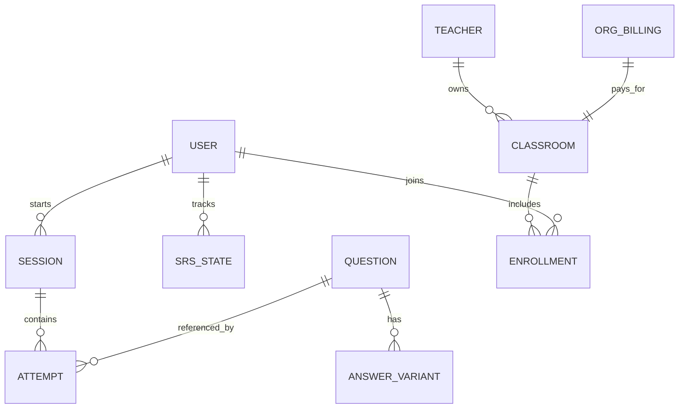
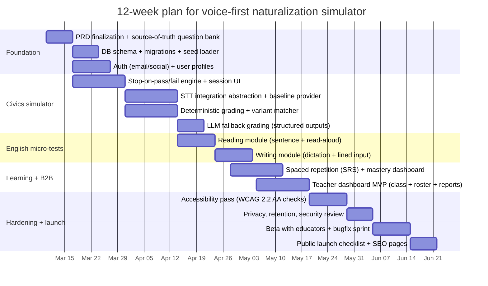

# PRD for a Voice-Optimized USCIS Naturalization Test Simulator

## Executive summary

A format-accurate “citizenship test simulator” should be built as an **interview-like experience**, not a quiz app. Primary sources consistently indicate that the civics portion is **administered orally by an officer**, and—under the **2025 civics test**—draws from a **128-question bank**, asks **up to 20 questions**, requires **12 correct to pass**, and must **stop early** when the applicant **passes (12 correct)** or **fails (9 incorrect)**. citeturn1view0turn19view0turn22view0turn10view0

English testing is “micro-task” based: speaking is assessed through the interview interaction, and reading/writing are short, controlled tasks; USCIS has moved reading/writing administration to **digital tablets** (sentence displayed for reading; lines displayed for writing with stylus), while the civics test remains verbal, and paper may still be used case-by-case. citeturn16view0turn12view0turn10view0turn9view0turn9view1

Because the real test is oral and open-response, the product’s core differentiation should be: **voice-first civics simulation + conservative grading that accepts alternative phrasing + stop-on-pass/fail behavior + dynamic “officials can change” handling + accessibility-ready non-voice alternatives**. The app should be mobile + web friendly via a **PWA-first web app** with optional native wrapper later, and should include an educator view because adult-citizenship programs use standards-based curricula and benefit from progress tracking. citeturn28view0turn22view0turn16view0

## Official constraints and success metrics

### Non-negotiable format constraints from primary sources

**Civics is oral and administered by an officer.** Regulations require the history/government examination be “given orally in English” by a designated officer, with defined interpreter exceptions. citeturn10view0

**2025 civics test operational rules (core simulation rules).**
- Bank size: 128 questions. citeturn19view0turn22view0  
- Questions asked: up to 20. citeturn22view0turn19view0turn1view0  
- Pass: 12 correct. citeturn19view0turn1view0turn22view0  
- Stop rule: stop when pass (12 correct) or fail (9 incorrect). citeturn1view0turn19view0  
- Some civics answers can change due to elections/appointments; applicants must answer with the official serving at the time of interview. citeturn22view0  
- USCIS acknowledges additional correct answers may exist, but encourages applicants to respond using the provided answers. citeturn22view0  

**English speaking assessment is embedded in the interview.** The applicant’s ability to speak English is determined from answers to questions normally asked during the examination. citeturn10view0turn9view0

**Reading/writing are short tasks and now commonly tablet-based.** USCIS guidance (distributed via entity["organization","American Immigration Lawyers Association","immigration bar association"]) describes tablet administration: a sentence appears on the tablet for reading; lines appear for writing; the officer reads a sentence aloud; civics continues verbally; and paper may still be used case-by-case. citeturn16view0

**Interview procedure and documentation.** Rules require the applicant be questioned under oath/affirmation, in a setting apart from the public; USCIS must maintain notations including a record of English and civics tests; questions may be repeated/rephrased; interpreter use (if authorized) must be noted; and the application affidavit/corrections become part of the record. citeturn12view0turn10view0

### Product success metrics aligned to the real test

Success metrics should map to test-like performance rather than generic “engagement.”

- **Primary outcome metric:** “Simulated pass rate under 2025 stop rules” after X days of use, stratified by initial diagnostic level. citeturn1view0turn19view0  
- **Format fidelity metrics:** percentage of sessions conducted voice-first; average time-to-pass; distribution of “stop on pass” and “stop on fail” events. citeturn1view0turn22view0  
- **Learning metrics:** recall stability for questions with multiple acceptable answers (measured via spaced repetition scheduling). citeturn22view0  
- **Accessibility metrics:** WCAG 2.2 AA conformance checks for core flows (login, practice, results, payments). citeturn20search3turn20search7  

## Target users and personas

This app serves multiple user types; personalization must remain **test-format aware** and **legally accurate** about exemptions.

### Core personas

**Everyday applicant (English required).**
- Needs oral recall practice and confidence under interview pressure.
- Must practice speaking, reading, writing, civics. citeturn24view0turn10view0  

**Applicant eligible for English exemption (50/20 or 55/15).**
- English requirement may not apply if age + residency thresholds are met. citeturn10view0  
- Still must meet civics requirement, typically with interpreter/native-language administration permitted under defined rules. citeturn10view0turn12view0  

**65/20 special consideration applicant.**
- May study only the 20 asterisk-marked questions, is asked 10 of those, and needs 6 correct; may take civics in language of choice. citeturn22view0turn1view0turn19view0  

**Medical disability exception pathway (N‑648).**
- Exception vs accommodation must be handled correctly; Form N‑648 is for exceptions, not to request accommodations, and accommodations may include sign language interpreters, extended time, or off-site completion. citeturn13view0turn10view0  

**Educator / program manager (B2B).**
- Runs classes aligned to standards across pre-interview, interview/test, and post-interview phases; needs cohort tracking, lesson planning support, and measurable progress. citeturn28view0  

### Language and localization needs

Even though civics is generally oral **in English**, official materials explicitly support non-English administration in some cases (exemptions, special consideration), and adults learn best with bilingual scaffolding. The product should therefore treat localization as:
- UI + explanations in major languages, with English-first practice modes.
- A regulated “native-language civics mode” only when the user selects (and acknowledges) they qualify under the rules. citeturn10view0turn22view0  

## Core features and UX flows

### Feature priority table

| Feature | Priority | Why it matters | Source anchor |
|---|---:|---|---|
| Voice-first 2025 civics simulator (ask-by-voice, answer-by-voice) | P0 | Civics is oral; applicants must speak answers without choices | citeturn10view0turn22view0turn1view0 |
| Stop-on-pass/fail engine (12 correct / 9 incorrect, ≤20 asked) | P0 | Required 2025 procedural behavior | citeturn1view0turn19view0 |
| Conservative grading with “alternative phrasing” acceptance | P0 | USCIS acknowledges additional correct answers; older scoring guidance accepts alternative phrasing | citeturn22view0turn9view1 |
| “Officials can change” answer handling + update workflow | P0 | Some answers change; must reflect interview-time officials | citeturn22view0 |
| English reading micro-test (read aloud 1 of up to 3) | P1 | Matches short-task nature of reading test | citeturn9view0turn16view0 |
| English writing micro-test (dictation + stylus/typing; 1 of up to 3) | P1 | Matches tablet-based writing administration | citeturn9view1turn16view0 |
| N‑400 speaking/comprehension drills | P1 | Speaking is assessed via interview Q&A | citeturn10view0turn12view0turn24view0 |
| Spaced repetition scheduler + mastery tracking | P1 | Needed to retain large bank and reduce failures | citeturn22view0turn19view0 |
| Localization + bilingual explanations | P2 | Supports comprehension; required for exemption flows | citeturn10view0turn22view0 |
| Teacher/B2B dashboard | P2 | Standards-based adult ed use case | citeturn28view0 |

### UX flows optimized for mobile + web

**Flow A: Choose correct test version**
1) User enters N‑400 filing date.  
2) App selects “2008 test” vs “2025 test” logic and presents an explanation + disclaimer.  
This prevents a high-impact user error, since test version depends on filing date for the 2025 transition. citeturn1view0turn19view0

**Flow B: 2025 civics mock interview (voice-first)**
- Start → “Officer voice” asks Q1 (TTS) → User speaks answer → STT transcript appears → Grading decision (Correct/Incorrect/Needs review) → Continue until stop rule triggers.  
Stop rule is mandatory: stop at 12 correct or 9 incorrect, else max 20. citeturn1view0turn19view0

**Flow C: Reading micro-test**
- Show sentence on screen (and optionally TTS prompt “Please read this sentence”) → User reads aloud → STT checks content-word integrity and long pauses (heuristic) → Pass on 1 correct out of up to 3. citeturn9view0turn16view0

**Flow D: Writing micro-test**
- Display “lined paper” UI (canvas or text input) → Officer voice dictates sentence → User writes/ types → Evaluate meaning-preserving match (lenient punctuation/spelling unless meaning breaks). Pass on 1 correct out of up to 3. citeturn9view1turn16view0

**Flow E: Teacher dashboard**
- Teacher creates class → generates join code → sees cohort progress by skill domain (civics/reading/writing/speaking) aligned to the naturalization phases and progress standards used in adult citizenship education. citeturn28view0turn24view0

### Sample voice-interview script and scoring rubric

**Script excerpt (2025 civics mode):**
- “I am conducting your civics test. I will ask up to 20 questions. I will stop when you pass or fail.” citeturn1view0turn19view0  
- Q: “What does ‘We the People’ mean?” (example from the 2025 128-bank) citeturn22view0  
- Q: “Who is one of your state’s U.S. senators now?” (dynamic-answer example) citeturn22view0  

**Scoring rubric (app-side, conservative):**
- **Correct** if transcript matches any canonical answer variant; also accept “alternative phrasing” when meaning clearly equivalent (prefer deterministic checks; LLM only for ambiguous cases). citeturn22view0turn9view1  
- **Incorrect** if transcript contradicts canonical answer or is unrelated.  
- **No response** if silence/empty transcript (counts as incorrect). citeturn9view1  
- **Dynamic officials questions:** require match to current official at interview-time; app must provide an update mechanism and show last-updated stamp. citeturn22view0  

## Data model and technical architecture

### Data model (conceptual)

Key design principle: separate **question content** from **accepted-answer logic** and from **session scoring** so you can update dynamic official answers without rewriting historic sessions.

**Core entities**
- `User` (language prefs, exemption flags, accessibility prefs)
- `Question` (id, prompt, category, difficulty tag, dynamic_answer_type?)
- `AnswerVariant` (question_id, variant_text, match_type, locale, canonical_bool)
- `Session` (user_id, mode, test_version, start/end, stop_reason)
- `Attempt` (session_id, question_id, transcript, audio_ref?, correctness, confidence, grader_version)
- `SRSState` (user_id, question_id, next_due_at, ease_factor, interval)
- `Teacher` + `Classroom` + `Enrollment` (B2B)
- `OrgBilling` (plans, seats)

### ER diagram (Mermaid)



### Architecture blueprint

A practical architecture is a web-first PWA with a small backend, built around “voice sessions” that are bandwidth- and latency-sensitive.

**Frontend**
- Next.js or similar SSR framework for SEO + fast TTI.
- PWA installability, offline caching for question bank (non-sensitive).
- Voice UI module: mic capture, VAD (voice activity detection), streaming upload or chunked upload depending on STT provider.

**Backend**
- API server (Node/TypeScript or Python) for:
  - Auth/session management
  - Secure audio upload URLs (pre-signed)
  - Grading pipeline orchestration (deterministic → LLM fallback)
  - Analytics events ingestion

**Database**
- Postgres (question bank, variants, attempts, SRS).
- Object storage for audio blobs (short retention by default).

**Speech and AI layer**
- STT provider abstraction (Google / AWS / Azure / OpenAI Audio STT) with a common interface.
  - Google Speech-to-Text: pricing reference point $0.016/min standard recognition. citeturn25search2  
  - AWS Transcribe: pricing reference point $0.024/min in low-volume tier. citeturn26search0  
- TTS provider abstraction (Amazon Polly / OpenAI TTS / browser-native fallback).
  - Amazon Polly Neural and Standard pricing are per character; published rates exist for standard and neural tiers. citeturn25search3  
- LLM grading:
  - Use OpenAI Responses API with structured outputs to return `{is_correct, rationale, matched_variant_id, confidence}` when deterministic matching is inconclusive. citeturn27search1turn27search3  
  - Monitor cost via OpenAI API pricing. citeturn27search0turn27search2  

**Caching and cost controls**
- Cache “question audio” (TTS output) keyed by `question_id + voice + locale`.
- For STT/LLM calls, apply:
  - attempt-level caching (same audio hash → same transcript)
  - “LLM fallback only” rule: call LLM only when deterministic score is in an uncertainty band.

### Data ingestion: the 2025 question bank

Seed the initial question bank from the USCIS-published 2025 “128 Civics Questions and Answers” document (M‑1778 (05/25)), which also documents dynamic-answer caveats and special consideration rules. citeturn22view0

Implementation implication: store per-question attributes:
- `is_starred_6520` (for 65/20 mode) citeturn22view0  
- `is_dynamic_official` + `dynamic_type` (President, Speaker, Senator, Representative, etc.) citeturn22view0  
- `accepted_answer_variants[]` (multiple canonical bullets; allow more than one correct)

## QA, acceptance criteria, privacy, and legal constraints

### Prioritized acceptance criteria

| Area | Priority | Acceptance criteria |
|---|---:|---|
| Civics stop logic | P0 | For 2025 mode: session ends immediately at 12 correct **or** 9 incorrect, never exceeding 20 questions. citeturn1view0turn19view0 |
| Oral simulation fidelity | P0 | Default mode uses TTS prompts + mic capture; no multiple-choice required to proceed. Civics remains verbal (mirrors USCIS tablet guidance). citeturn16view0turn10view0turn22view0 |
| Scoring leniency | P0 | Accept alternative phrasing when meaning matches; show “USCIS may have additional correct answers” note and encourage official phrasing. citeturn22view0turn9view1 |
| Dynamic-official answers | P0 | For questions flagged dynamic, app must display “answers may change” + last update date; update workflow must exist. citeturn22view0 |
| Reading/writing mechanics | P1 | Reading: pass on 1 correct of up to 3; Writing: pass on 1 correct of up to 3; apply “meaning-based” writing scoring (don’t fail minor spelling/punctuation unless meaning breaks). citeturn9view0turn9view1turn16view0 |
| Accessibility | P1 | Core workflows meet WCAG 2.2 AA; voice features have equivalent non-voice paths; captions/transcripts available. citeturn20search3turn20search7turn20search11 |
| Interview-procedure realism | P1 | Include “under oath” framing and rephrase capability; reflect that officers repeat/rephrase questions and record results. citeturn12view0turn10view0 |
| Data integrity | P1 | Every attempt stored with grader version; ability to replay/trace scoring decisions. citeturn12view0 |

### Functional QA test cases

**2025 civics engine**
- Given 11 correct, next correct must end the session with stop_reason=`PASS_REACHED_12`.
- Given 8 incorrect, next incorrect must end the session with stop_reason=`FAIL_REACHED_9`.
- Given 19 questions asked without reaching thresholds, 20th question ends session with stop_reason=`MAX_20_REACHED`. citeturn1view0turn19view0

**Reading/writing**
- Reading passes if 1 sentence read correctly (simulate with transcript). citeturn9view0turn16view0  
- Writing passes if meaning matches dictated sentence despite minor spelling/punctuation variance; fails if no response/illegible/different meaning. citeturn9view1turn16view0  

**Interpreter/exemptions flags**
- If user selects English exemption, civics language mode becomes available; otherwise remains English-only by default. citeturn10view0turn22view0  

### Privacy, security, and legal constraints

**No implied endorsement / no agency branding.** Do not use DHS/USCIS seals, logos, or branding in a way that implies endorsement; U.S. government guidance warns against using agency logos without permission and against implying agency endorsement. citeturn20search1turn20search2turn20search10

**Public-domain content nuance.** U.S. government works are generally not subject to U.S. copyright protection under 17 U.S.C. § 105, but trademarks/logos are still restricted, and international reuse may differ. citeturn20search0turn20search1

**Data retention defaults (recommended)**
- Store transcripts and correctness long-term (learning value).
- Store raw audio short-term (e.g., 7–30 days) unless user opts in for “coach review,” because audio is more sensitive than text (assumption; policy choice).
- Encrypt at rest, TLS in transit, role-based access for educators.

**Payments and PCI**
- Use a hosted payments provider (e.g., Stripe Checkout) to avoid handling card data; Stripe publishes standard online card processing fees (2.9% + $0.30 per transaction for domestic cards). citeturn26search5  
- HIPAA is not generally applicable because this is not a covered healthcare service (assumption), but N‑648-related flows should be written carefully and avoid collecting medical documents unless you explicitly choose to support that workflow. citeturn13view0turn10view0  

## Roadmap, cost estimates, and AI coding-agent build plan

### Twelve-week delivery timeline (Mermaid Gantt)



### Cost model (with explicit assumptions)

Costs depend mainly on **voice minutes** (STT) and **AI grading** (LLM).

**Assumptions (explicit)**
- Average civics session uses 8 minutes of recorded audio (question + answer time, pauses).
- 10,000 sessions/month at early scale (adjustable).
- 70% of attempts graded deterministically; 30% need LLM fallback (tunable).
- Chosen provider examples below are pricing anchors, not commitments.

**Variable cost reference points**
- Google Speech-to-Text: $0.016/min standard model. citeturn25search2  
- AWS Transcribe: $0.024/min for initial tier. citeturn26search0  
- OpenAI LLM tokens and audio model pricing vary by model; use official API pricing pages to estimate per-request costs. citeturn27search0turn27search2  
- Amazon Polly: charges per character; published standard/neural rates exist. citeturn25search3  
- Hosting: AWS Lightsail offers low-cost fixed monthly bundles (example starter $5/mo for some instances). citeturn25search0  
- Vercel Pro includes a $20/mo platform fee and usage-based overages. citeturn25search5turn25search1  

**Quick example (STT only):**
- 10,000 sessions/month × 8 min = 80,000 minutes
  - Google STT ≈ 80,000 × $0.016 = **$1,280/month** (STT only). citeturn25search2  
  - AWS Transcribe ≈ 80,000 × $0.024 = **$1,920/month** (STT only). citeturn26search0  

Practical implication: you must aggressively reduce minutes (VAD, stop recording when user stops speaking) and reduce LLM calls via deterministic grading first.

### Developer task list for an AI coding agent

Below is a “tickets-first” plan (Epics → Stories → Acceptance tests) designed to be handed to a coding agent.

#### Epic: Source-of-truth test rules and question bank

**Story: Implement 2025 civics rule engine**
- Implement state machine with counters: `correct`, `incorrect`, `asked`.
- Stop conditions:
  - `correct == 12` → pass
  - `incorrect == 9` → fail
  - `asked == 20` → end (neither threshold)
- Acceptance tests:
  - Unit tests for all stop conditions and edge cases (e.g., reaching 12 on question 12 ends immediately). citeturn1view0turn19view0  

**Story: Seed the 2025 128-question bank**
- Parse and load questions + answer bullets from M‑1778 (05/25) into DB.
- Mark:
  - starred 65/20 questions
  - dynamic-answer questions
- Acceptance tests:
  - All 128 loaded; zero duplicates; all have at least 1 answer variant. citeturn22view0  

**Sample codegen prompt**
```text
Implement a TypeScript state machine for the 2025 civics test:
- maxQuestions=20
- passAtCorrect=12
- failAtIncorrect=9
- stop immediately when pass/fail reached
Return stop_reason enum and next_question_needed boolean.
Provide Jest tests for boundary conditions.
```

#### Epic: Voice capture, STT, and transcript UX

**Story: Browser voice capture with VAD**
- Implement mic permission, record PCM/Opus chunks, stop on silence.
- Acceptance tests:
  - Works on iOS Safari + Android Chrome + desktop Chrome (manual QA matrix).
  - If mic permission denied, user can switch to typed-input simulation (accessibility fallback). citeturn20search3turn20search7  

**Story: STT provider abstraction**
- Interface: `transcribe(audioBlob) -> {text, confidence, durationMs}`
- Implement at least one provider adapter (Google/AWS/OpenAI) behind feature flag.
- Acceptance tests:
  - Fakes for tests; integration test hits sandbox keys in CI only.

**Sample codegen prompt**
```text
Create an STTProvider interface and implement GoogleSpeechSTTProvider and MockSTTProvider.
Support async transcription and capture raw provider metadata.
Include unit tests for adapter selection via env var STT_PROVIDER.
```

#### Epic: Grading pipeline (deterministic first, LLM fallback)

**Story: Deterministic answer matcher**
- Normalize transcript:
  - lowercase, strip punctuation
  - number normalization (e.g., “twenty-seven” vs “27”) for numeric answers
- Matching:
  - exact match against variants
  - token-set similarity threshold
  - synonyms map for common equivalents (e.g., “u.s.” vs “united states”)
- Acceptance tests:
  - Correctly accepts multiple bullet answers for the same question. citeturn22view0  

**Story: LLM fallback grader with structured output**
- Only triggered when deterministic matcher returns “uncertain.”
- Use structured outputs so response adheres to schema. citeturn27search3turn27search1  
- Acceptance tests:
  - Schema validation rejects malformed responses
  - Audit log stores prompt, model, and output id (no PII beyond transcript)

**Sample codegen prompt**
```text
Build a grading pipeline:
1) deterministic score -> correct/incorrect/uncertain
2) if uncertain, call OpenAI Responses API with structured output schema:
   {is_correct:boolean, confidence:0..1, matched_variant_id:string|null, explanation:string}
Return a single GradeResult object.
Include tests with mocked OpenAI client.
```

#### Epic: English micro-tests (reading/writing)

**Story: Reading test module**
- UI shows one sentence at a time; user reads aloud; pass on 1 correct out of up to 3. citeturn9view0turn16view0  
- Acceptance tests:
  - After first pass, module ends immediately
  - Long pauses cause fail (heuristic), but accent does not penalize (design consistent with scoring guidance language). citeturn9view0  

**Story: Writing test module**
- “Lined paper” canvas with stylus support; fallback to typing box.
- Dictation by TTS; pass on meaning-equivalent answer; lenient punctuation/spelling unless meaning changes. citeturn9view1turn16view0  
- Acceptance tests:
  - “Numbers may be spelled out or written as digits” accepted where applicable (implement numeric normalization). citeturn9view1  

#### Epic: Spaced repetition and educator dashboard

**Story: SRS scheduling**
- Maintain per-question SRS state; schedule next due; daily review list.
- Acceptance tests:
  - Missed question reduces interval; correct increases, deterministic.

**Story: Teacher dashboard MVP**
- Create class; join via code; view mastery distribution; export CSV.
- Acceptance tests:
  - Teacher sees only their roster (authorization tests).

Justification: citizenship education programs use standards and progress measures across interview/test phases, making cohort reporting valuable. citeturn28view0

### Launch checklist

- **Content accuracy check:** confirm all 128 questions and answer bullets match the official M‑1778 (05/25) text; flag dynamic-answer questions and link to “test updates” guidance in-app. citeturn22view0  
- **Legal UI checklist:** no DHS/USCIS seals/logos; clear “not affiliated” statement; no implied endorsement language. citeturn20search1turn20search2turn20search10  
- **Accessibility:** WCAG 2.2 AA audit on onboarding, practice, results, payments; captions/transcripts for TTS prompts. citeturn20search3turn20search7turn20search11  
- **Pilot partners:** at least 2 adult citizenship classes to validate teacher dashboard and usability (educator workflows are explicitly a target audience for USCIS-linked standards resources). citeturn28view0  
- **SEO:** landing pages for “2025 civics test 128 questions,” “20 questions 12 correct,” “stop at 12,” plus multilingual pages (UI localized; practice remains English-first except exemptions). citeturn19view0turn22view0turn10view0  

### Prioritized primary sources to attach to the PRD

- Federal Register notice implementing 2025 civics stop-on-pass/fail procedure and filing-date schedule. citeturn1view0  
- USCIS Policy Alert PA‑2025‑24 (via AILA PDF) summarizing policy highlights and applicability. citeturn19view0  
- USCIS 2025 civics bank document (M‑1778 (05/25)) with dynamic-answer notes and 65/20 rules. citeturn22view0  
- 8 CFR Part 312 (literacy, civics oral procedure, interpreter rules, retest). citeturn10view0  
- 8 CFR 335.2 (interview procedure, oath, record notations, repeating questions, interpreter notation). citeturn12view0  
- USCIS tablet administration alert (copied via AILA PDF). citeturn16view0